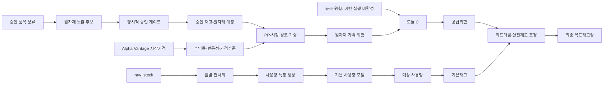

# 원자재 매핑 승인 및 최종 재고량 실험 보고서

- 작성일: 2026-07-23 KST
- 작업 브랜치: `experiment/material-mapping-inventory-pilot`
- 정책 버전: `material-approval-pilot-v1.0`
- 모듈 C 버전: `module-c-v1.0`
- 상태: **실험 결과, 운영 배포 불가**

## 1. 결론

전체 원자재 후보를 일괄 승인하지 않았다. 공식 자료와 내부 품질 게이트를 모두 통과한 **일회용 주사기-폴리프로필렌(PP)** 경로만 실험 브랜치에서 승인했다.

| 항목 | 결과 |
|---|---:|
| 원자재 후보 행 | 11,383 |
| 후보 로컬 품목 | 4,969 |
| 승인 로컬 품목 | 2,212 |
| 부서 단위 승인 재고 키 | 2,297 |
| 2026-01 예측에 실제 존재하는 승인 키 | 871 |
| 위험정책 적용 키 | 871 |
| 양수 재고 버퍼가 생긴 키 | 808 |
| 예측 사용량이 0이라 버퍼도 0인 승인 키 | 63 |
| 미승인 품목의 비정상 양수 버퍼 | 0 |

기본 사용량 예측은 승인 전후 완전히 동일했다. 원자재 위험은 사용량 예측값을 직접 올리지 않고 조달 리드타임과 안전재고에만 반영했다.

| 최종 재고 결과 | 값 |
|---|---:|
| 전체 예측 사용량 합 | 15,836,473.3613 |
| 기본재고량 합 | 19,003,768.0336 |
| 원자재 위험 버퍼 합 | 14.0469 |
| 최종 목표재고량 합 | 19,003,782.0805 |
| 전체 기본재고 대비 증가율 | 0.0000739% |
| 양수 사용량 승인 품목별 목표재고 증가율 | 0.163786% |

증가 폭이 작은 것은 오류가 아니다. 2025-12 Brent 신호가 낮았고, PP 연결도 간접 대체지표와 보수적 신뢰도 감쇠를 거쳤기 때문이다.

## 2. 승인 범위

승인 규칙은 다음 한 개뿐이다.

| 필드 | 승인값 |
|---|---|
| `item_family_id` | `DISPOSABLE_SYRINGE` |
| `item_subtype_id` | `SYRINGE_USAGE_BASED` |
| `raw_material_meta_code` | `POLYPROPYLENE_PP` |
| 사용 부위 | `barrel_and_plunger` |
| 관계 | `direct_component` |
| 매핑 가중치 | 0.70 |
| 노출 가중치 | 0.70 |
| 매핑 신뢰도 | `medium`, 수치 0.65 |

주사기 전체가 PP만으로 구성된다는 뜻은 아니다. 현재 승인은 배럴과 플런저의 PP 노출만 나타낸다. 바늘의 스테인리스강, 피스톤의 고무, 접착제와 포장재는 별도 매핑이 필요하다.

나머지 9,171개 후보 행은 `not_in_explicit_approval_policy`로 유지했다. 이부프로펜 클러스터의 알루미늄·PP 같은 광범위 기본값, 제품별 재질이 불명확한 카테터, 공급위험 정책 검토가 필요한 품목은 승인하지 않았다.

## 3. 승인 게이트

아래 조건을 모두 통과해야 `stock_item_material_mapping.csv`에 기록된다.

1. 품목군, 세부유형, 원자재 코드가 명시적 승인 규칙과 정확히 일치한다.
2. 근거 등급이 규칙에서 허용한 등급이다.
3. 분류 품목군과 원자재 품목군 충돌이 없다.
4. `material_confidence=identified`이다.
5. 원자재 근거 URL이 비어 있지 않다.
6. 승인된 원자재-시장지표 경로가 하나 이상 등록돼 있다.
7. 공급위험 정책의 추가 검토 플래그가 없다.
8. 월별 재고의 기관·부서·품목 키로 정확히 확장된다.
9. 중복, 빈 필수값, 가중치 범위, 검토시각을 재검증한다.
10. 임시 파일 검증이 끝난 뒤에만 운영 매핑 파일을 원자적으로 교체한다.

기관 코드 자체에 `::`가 포함되는 원본 사례가 있어 구분자 개수를 정확히 2개로 가정하지 않는다. 승인 키는 원본 월별 재고에서 직접 가져오며 최소 구조와 정확한 조인으로 검증한다.

## 4. 물질 연결 근거

공식 자료는 **구조적 연결을 뒷받침**한다. 0.70, 0.65 같은 수치 자체를 증명하는 자료는 아니며, 수치는 보수적으로 설정한 내부 정책 초기값이다.

| 연결 | 근거 | 판단 |
|---|---|---|
| 일회용 주사기 -> PP | [UNICEF 10mL 일회용 주사기 사양](https://supply.unicef.org/s0782413.html)은 의료용 플라스틱으로 PE, PP, PS를 열거한다. | PP가 흔하지만 모든 제품이 PP라고 단정할 수 없어 중간 신뢰도 적용 |
| 배럴·플런저 -> PP | [FDA 510(k) K190002](https://www.accessdata.fda.gov/cdrh_docs/pdf19/K190002.pdf)는 해당 제품의 배럴과 플런저를 PP로, 바늘을 스테인리스강으로 구분한다. | 부품 단위 PP 연결을 직접 지지 |
| 주사기 -> PP | [WHO PQS E013/070](https://extranet.who.int/prequal/sites/default/files/imd_products/47fd4600-3bfb-4a03-a058-0c4196d09328_0.pdf)은 해당 10mL 주사기 재질을 PP로 명시한다. | 다른 공식 제품 사례로 교차 확인 |
| 나프타 -> 프로필렌 -> PP | [미국 에너지부 화학산업 프로필](https://www1.eere.energy.gov/manufacturing/resources/chemicals/pdfs/profile_chap3.pdf)은 나프타를 포함한 탄화수소 스팀크래킹으로 프로필렌을 만들고, 프로필렌 중합으로 PP를 생산하는 경로를 설명한다. | 나프타가 PP의 직접 상류지표라는 구조적 근거 |
| Brent 가격 | [Alpha Vantage 공식 API 문서](https://www.alphavantage.co/documentation/)의 Brent 원유 시계열을 사용했다. | 직접 나프타 가격이 없을 때만 쓰는 간접 대체지표 |

## 5. 가중치와 계산 근거

### 5.1 시장 신호

시장지표 위험은 다음과 같다.

```text
return_risk     = clip(max(return_30d, 0) / 0.20, 0, 1)
volatility_risk = clip(volatility_30d / 0.12, 0, 1)
price_risk      = clip(max(price_vs_90d_mean, 0) / 0.15, 0, 1)

market_factor_risk
  = 0.45 * return_risk
  + 0.30 * volatility_risk
  + 0.25 * price_risk
```

30일 수익률은 방향성 급등, 변동성은 조달 불확실성, 90일 평균 대비 가격은 지속적인 고가격 상태를 나타내도록 했다. `0.45/0.30/0.25`와 임계값은 공개 연구에서 추정한 인과계수가 아니라 `policy_seed_requires_backtest` 상태의 내부 초기값이다.

### 5.2 PP-시장 경로

등록된 경로는 다음 두 개다.

| 시장지표 | 전달 가중치 | 대체지표 품질 | 현재 사용 여부 |
|---|---:|---:|---|
| 나프타 | 0.80 | 1.00 | 가격 파일 부재로 미사용 |
| Brent | 0.20 | 0.60 | 사용 |

Brent 경로의 실제 경로 가중치는 다음과 같다.

```text
path_weight
  = transmission_weight
  * proxy_quality
  * mapping_weight
  * exposure_score
  * mapping_confidence_score

  = 0.20 * 0.60 * 0.70 * 0.70 * 0.65
  = 0.03822
```

직접 나프타 가격이 들어오면 동일 계산에서 경로 가중치는 `0.80 * 1.00 * 0.70 * 0.70 * 0.65 = 0.2548`이다. 현재 결과보다 크게 반영되므로 나프타 공급자와 단위 검증이 먼저 필요하다.

`lag_days=21`은 경로 메타데이터와 감사표에 저장되지만 현재 월 단위 계산에서 일별 시계열을 명시적으로 이동시키지는 않는다. 한 달 앞 예측의 기준월 신호로 사용 중이며, 일 단위 지연효과 구현과 검증은 후속 과제다.

### 5.3 2025-12 실제 신호

```text
Brent return_30d              = -0.044690
Brent volatility_30d          =  0.072531
Brent price_vs_90d_mean       = -0.035025
market_factor_risk            =  0.181326
path_weight                   =  0.038220
PP commodity_risk             =  0.006930296
market_signal_confidence      =  0.390000
```

수익률과 평균 대비 가격은 음수라 양의 위험으로 반영되지 않았다. 이 달의 위험은 변동성 항에서만 발생했다.

### 5.4 공급위험 결합

```text
supply_risk
  = 0.45 * supply_news_risk
  + 0.20 * material_news_risk
  + 0.35 * commodity_risk
```

이번 실행에서는 완결된 뉴스 데이터와 승인된 질병-수요 매핑이 없어 두 뉴스 항을 0으로 고정했다.

```text
supply_risk = 0.35 * 0.006930296 = 0.0024256036
```

뉴스 미수집을 0위험으로 해석한 운영 결과가 아니라, **뉴스 신호를 사용하지 않은 시장가격 전용 실험**이다.

### 5.5 최종 재고량

기본 정책은 검토주기 30일, 기본 리드타임 0일, 기본 안전재고율 20%다.

```text
base_stock = predicted_usage * (review_days + lead_days) / 30 * 1.20

risk_adjusted_usage = predicted_usage * (1 + 0.35 * demand_risk)
effective_lead_days = lead_days * (1 + 0.50 * supply_risk)
                    + 14 * supply_risk
dynamic_safety_rate = 0.20 + 0.25 * supply_risk

unconstrained_target
  = risk_adjusted_usage
  * (review_days + effective_lead_days) / 30
  * (1 + dynamic_safety_rate)

risk_buffer = min(
  max(unconstrained_target - base_stock, 0),
  protection_period_demand * 0.75
)

target_stock = base_stock + risk_buffer
```

이번 실행은 수요위험이 0이므로 예상 사용량을 올리지 않는다. 공급위험 `0.0024256036`으로 유효 리드타임은 `0.03395845일`, 안전재고율은 `0.2006064`가 되며, 양수 사용량이 있는 승인 품목의 목표재고는 기본재고보다 `0.163786%` 증가했다.

## 6. 시스템 흐름



처리 순서는 다음과 같다.

1. 승인 분류와 통합 원자재 후보를 결합한다.
2. 승인 정책을 드라이런해 승인·제외 사유를 감사표로 남긴다.
3. `--apply`에서 검증된 매핑만 원자적으로 반영한다.
4. 외부 가격을 30일 수익률, 30일 변동성, 90일 평균 대비 가격으로 바꾼다.
5. 원자재 경로 신뢰도를 곱해 품목별 가격위험을 만든다.
6. 모듈 C가 뉴스와 가격위험을 수요위험·공급위험으로 분리한다.
7. 검증구간에서 가장 좋은 사용량 모델을 선택한다.
8. 사용량 예측과 공급위험을 재고정책에서 결합한다.
9. 품목별, 규격별, 전체 영향 보고서를 생성한다.

## 7. 모델 비교

모델 선택은 테스트 구간을 보지 않고 시간순 교차검증 결과로 결정했다.

| 검증 모델 | WAPE | 선택 |
|---|---:|---|
| `stock_model_a_usage_only` | **40.1868%** | 예 |
| `stock_model_a_usage_tweedie` | 40.7695% | 아니오 |
| `stock_model_d_module_c` | 40.8595% | 아니오 |
| `baseline_rolling_mean_3` | 44.5183% | 아니오 |

모듈 C 특징 모델은 검증에서 기본 모델보다 0.6727%p 나빴다. 따라서 공급위험을 사용량 모델에 강제로 넣지 않고 재고정책 계층에서만 적용했다.

선택 후 테스트 구간에서는 모듈 C challenger WAPE가 37.5413%, 선택된 기본 모델이 38.8735%였다. 흥미로운 신호지만 테스트 결과로 모델을 다시 선택하면 정보 누출이 되므로 운영 모델을 바꾸지 않았다. 새로운 미래 검증구간에서 재현될 때 challenger 승격을 검토해야 한다.

뉴스 기반 B/C 모델은 뉴스 특징의 비영값이 없어 자동 제외됐다.

## 8. 품질 검증과 수정

- 승인 전후 예측 행 163,229개가 모두 일대일로 일치했다.
- `predicted_usage` 변경 행은 0개, 최대 절대 차이는 0이다.
- `base_stock` 변경 행은 0개, 최대 절대 차이는 0이다.
- 위험 0 품목에 남던 `1e-6` 수준 부동소수점 잔여 버퍼를 제거했다.
- 미승인 품목에서 양수 위험 버퍼가 생긴 행은 0개다.
- 원본 `raw_stock`에서 `0.05cc주사기(BCG)`가 8회 일관되게 확인되어 잘못 승인된 `05mL`를 `0.05mL`로 수정했다.
- 기관 코드 내부의 `::` 때문에 정상 재고 키가 거절되던 검증 오류를 수정하고 회귀 테스트를 추가했다.

## 9. 산출물

### 정책과 승인 데이터

| 파일 | 설명 |
|---|---|
| `data/mapping/material_approval_policy.json` | 승인 범위, 근거, 가중치 |
| `data/mapping/stock_item_material_mapping.csv` | 승인된 2,297개 부서 단위 매핑 |
| `outputs/material_mapping_approval_report.json` | 승인 수와 제외 사유 요약 |
| `outputs/material_mapping_approval_audit.csv` | 전체 11,383개 후보 감사표 |
| `data/sample/material_mapping_approval_sample_1000.csv` | 승인·제외 검토용 1,000개 표본 |

### 위험과 최종 재고량

| 파일 | 설명 |
|---|---|
| `outputs/stock_commodity_risk_scores.csv` | 55,128개 월-재고키 원자재 위험 |
| `outputs/stock_module_c_risk_scores.csv` | 55,128개 월-재고키 모듈 C 위험 |
| `outputs/stock_predictions.csv` | 163,229개 최종 품목별 재고 예측 |
| `outputs/stock_predictions_by_subtype.csv` | 2,359개 규격별 집계 |
| `outputs/material_mapping_inventory_impact_report.json` | 승인 전후 및 최종 영향 요약 |
| `outputs/material_mapping_inventory_impact_detail.csv` | 현재 예측에 적용된 871개 상세 |
| `outputs/material_mapping_inventory_impact_by_spec.csv` | 주사기 규격별 영향 집계 |
| `data/sample/material_mapping_inventory_impact_sample_1000.csv` | 영향 상세 표본, 현재 871개 전부 |

`outputs/`와 `data/sample/`은 Git 무시 경로다. 코드와 정책을 커밋하고 산출물은 아래 명령으로 재생성한다.

## 10. 재실행 방법

```bash
# 1. 후보 생성
python -m src.module_c.pipeline

# 2. 승인 드라이런과 감사표 생성
python -m src.module_c.material_approval

# 3. 검증된 승인 매핑 반영
python -m src.module_c.material_approval --apply

# 4. 외부 가격과 모듈 C 재계산
python -m src.commodity.commodity_risk_scorer
python -m src.module_c.pipeline

# 5. 사용량 모델과 최종 재고량
python -m src.feature_engineering
python -m src.modeling.training
python -m src.modeling.prediction

# 6. 최종 영향 보고서
python -m src.module_c.material_inventory_report
```

승인 전 파일과 직접 비교하려면 다음처럼 기준 예측 경로를 넘긴다.

```bash
python -m src.module_c.material_inventory_report \
  --baseline /path/to/stock_predictions_before_material_approval.csv
```

## 11. 운영 전 필수 과제

1. 직접 나프타 가격 또는 검증된 석유화학 가격평가 시계열을 연결한다.
2. `lag_days`를 일 단위 특징 계산에 실제 적용하고 백테스트한다.
3. GDELT 수집 제한을 해결하거나 승인된 뉴스 공급자로 완결된 이력을 만든다.
4. 질병-의료용품 수요 매핑을 별도 승인해 공급위험과 섞이지 않게 한다.
5. 제품별 BOM, PP 질량비, 공급사와 원산지를 확보해 0.70 정책값을 실측값으로 교체한다.
6. 리드타임 실측치와 결품 비용으로 재고 조정계수를 보정한다.
7. 2026-01 예측은 2025-12에서 끝난 원본 데이터에 기반해 현재 시점에는 오래된 결과다. 최신 `raw_stock`으로 다시 실행한다.
8. 도메인 담당자가 2,212개 로컬 품목 승인표를 검토하고 정식 승인자를 기록한다.

현재 결과는 파이프라인 연결과 보수적 정책 동작을 검증한 실험이다. 정식 조달 의사결정에는 사용하지 않는다.
