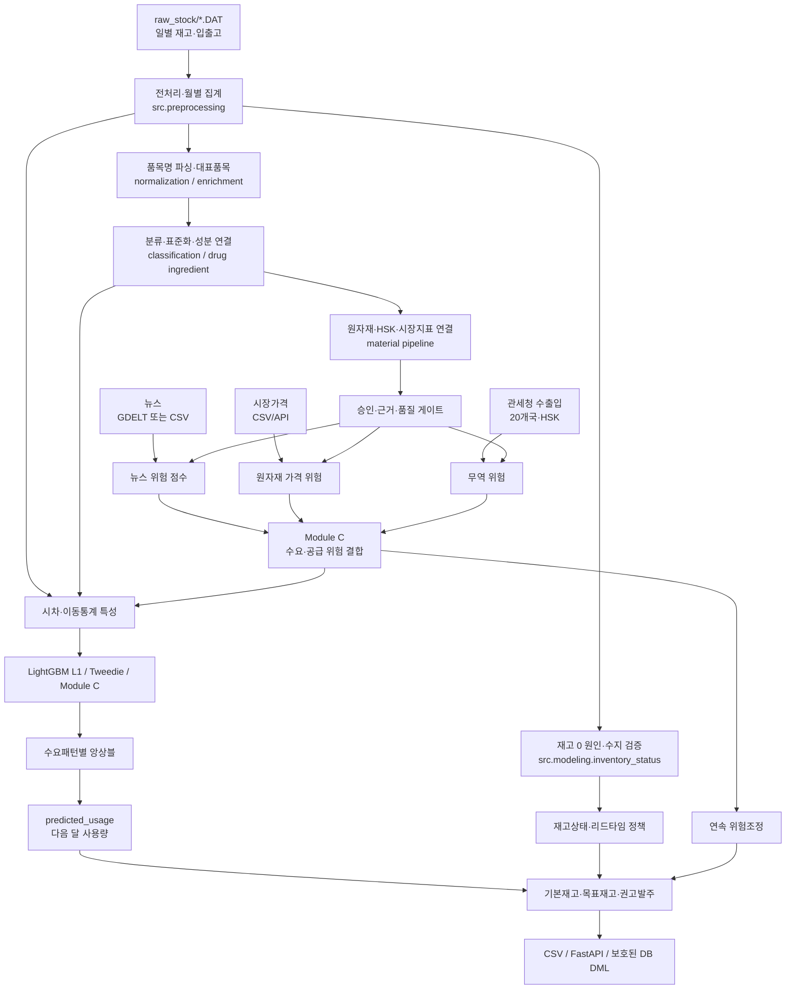

# 수정 결과, 성능 향상 및 운영 가이드

## 1. 문서 목적

이 문서는 현재 AI 저장소에 반영된 누적 수정 결과와 성능 변화, 실제 실행 순서를
한 번에 설명한다. 특정 개발자만 아는 실행 메모가 아니라 데이터 담당자, 품목 검토자,
AI 개발자, 백엔드 개발자와 발표자가 같은 구조와 용어를 공유하기 위한 팀 공통 문서다.

이 문서에서 사용하는 상태 표현은 다음과 같다.

- **구현됨**: 코드와 정책 파일이 존재하고 테스트할 수 있다.
- **계산 적용됨**: 현재 산출물 생성에 사용된다.
- **운영 승인됨**: 품질 게이트를 통과해 실제 자동발주나 DB 반영에 사용할 수 있다.
- **잠정 정책**: 합리적인 초기 근거는 있으나 실제 조달 결과로 재보정해야 한다.

구현됨이나 계산 적용됨을 운영 승인됨으로 해석하면 안 된다. 특히 전체 품목·원자재
후보의 `approved`는 사용자가 후보를 수용했다는 뜻이며, 모든 속성이 외부 사실로
검증됐다는 뜻은 아니다.

구현 세부 근거는 다음 문서를 함께 사용한다.

- `2026-07-29_03_20_COUNTRY_TRADE_WEIGHT_RECALIBRATION.md`
- `2026-07-29_04_TEMPORAL_TRAIN_VALIDATION_TEST_WEIGHT_TUNING.md`
- `2026-07-29_05_GITHUB_ISSUE_REMEDIATION.md`
- `2026-07-29_06_STANDARDIZED_HISTORY_LIGHTGBM_UPDATE.md`

## 2. 현재 상태 요약

| 영역 | 현재 상태 | 운영 해석 |
|---|---|---|
| 재고 원천 | `raw_stock/*.DAT`만 사용 | `device/`는 완전히 제외 |
| 현재자료 | 2024-01~2025-12 | 최신 원장은 현재 시점보다 오래돼 운영 발주 금지 |
| 과거자료 | 2018-01~2019-12 | 현재 표준품목 strict/core 매칭분만 학습 |
| 품목 후보 승인 | 409,519 / 409,519 | 후보 수용 100%, 외부 사실 검증 100% 아님 |
| 외부 근거 승인 | 4,969개 로컬 품목 | 정책상 자동발주 적격 표식, 실행 경로 강제는 미구현 |
| 예측 운영 적격 분류 | 65,715개 로컬 품목 | 세부유형·규격·단위가 완전한 범위 |
| 원자재 운영 적격 매핑 | 69,763행, 65,849 재고품목 | 원자재 식별·근거·품질 게이트 통과 범위 |
| 뉴스 | GDELT/CSV 수집기 구현 | 2024 학습구간 비영 신호가 없어 뉴스 B/C 학습 중단 |
| 시장가격 | CSV, Alpha Vantage, FRED, Nasdaq 수집기 구현 | 승인 registry와 매핑이 있는 경로만 점수화 |
| 수출입 | 관세청 20개국, HSK 32개 수집 완료 | 품절 대리목표로 보정, 실제 조달 성과 검증 필요 |
| Module C | 뉴스·가격·무역·질병 수요 결합 구현 | 계산에는 사용되지만 운영 배치 릴리스는 아직 차단 |
| 사용량 예측 | LightGBM 3개 모델과 패턴별 앙상블 | 2025-10~12 테스트 WAPE 37.1840% |
| DB 반영 | 보호된 DML loader 구현 | 명시적 기관 매핑·품질 통과·`--apply` 필요 |

현재 `outputs/module_c_supply_risk_quality_report.json`은
`batch_release_allowed=false`다. 따라서 Module C 결과는 모델 실험, 위험 설명과
검토 우선순위에는 사용할 수 있지만, 이 결과만으로 자동발주를 실행하면 안 된다.

## 3. 저장소 범위와 책임

### 3.1 AI 저장소가 담당하는 것

이 저장소는 다음 기능을 소유한다.

1. `raw_stock` 일별 자료의 검증·월별 집계
2. 품목명 파싱, 대표품목 생성, 분류·표준화 후보와 검토자료 생성
3. 의약품 성분, 의료용품 원자재, 원자재-HSK·시장지표 연결
4. 뉴스·시장가격·수출입 자료 수집과 위험 점수화
5. Module C 외부위험 결합, 감사표와 경보 생성
6. 사용량 특성 생성, 모델 학습·평가·앙상블
7. 기본재고, 위험조정 목표재고와 권고발주량 계산
8. 결과 파일, AI 조회 API와 품질을 통과한 제한적 DML 적재

### 3.2 백엔드가 담당하는 것

인증, 사용자·권한, 파일 업로드, import batch, 검수 UI, 대시보드 API, 알림 상태,
재배치·발주 승인 워크플로우, 실제 입출고 트랜잭션, 감사 로그와 DB DDL은 백엔드
저장소의 책임이다.

DB 책임은 다음처럼 나눈다.

```text
DB 스키마와 업무 트랜잭션: backend
검증된 AI 배치값의 제한적 DML: AI
```

AI loader는 `demand_class`, `mu_corrected` 같은 합의된 열만 갱신한다. 익명 기관코드와
DB 기관 ID의 명시적 매핑, 99% 이상 키 매칭, 배치 품질 통과가 없으면 rollback한다.
기본 동작은 dry-run이며 `--apply` 없이는 DB를 수정하지 않는다.

## 4. 전체 시스템 구조



정기 배치 진입점 `src.main`은 다음 순서로 실행된다.

```text
전처리
→ 재고상태
→ 뉴스
→ 시장가격
→ 수출입
→ Module C
→ 특성 생성
→ 모델 학습
→ 예측·재고권고
```

품목 전체 재분류, 공식 마스터 재수집, HSK 기준서 갱신, 과거 weight 탐색, 무역
weight 보정과 앙상블 weight 탐색은 정기 배치에 포함되지 않는다. 이 단계들은 승인
마스터나 관측기간이 바뀔 때 별도 실행하고 결과를 검토한 뒤 정책 파일로 고정한다.
즉 정기 실행과 정책 재보정은 의도적으로 분리돼 있다.

## 5. 데이터와 키 계약

### 5.1 원천과 시간 단위

| 구분 | 키와 의미 |
|---|---|
| 일별 원본 | 재고마감일 × 보건기관코드 × 부서코드 × 물품코드 |
| 월별 모델 | `year_month × institution_code × department × item_code` |
| 물리 시계열 | `institution_code × department × item_code` |
| 위험 결합 | `STD_YYYYMM × stock_item_key` |
| 예측 라벨 | 다음 달 `정상출고량` |
| 현재고 | 해당 월 마지막 `마감재고량` |

같은 이름이라도 기관·부서·내부코드가 다르면 물리 재고는 합치지 않는다. 반대로
표준 의미가 같으면 모델이 품목군·family·subtype·규격·단위 정보를 공유할 수 있다.
이는 재고를 섞지 않으면서 다른 기관에서 학습한 의미 정보를 활용하기 위한 구조다.

### 5.2 수요와 재고 수지

모델 수요는 `정상출고량`이다. 반품, 이동출고, 폐기와 자동폐기는 수요로 사용하지
않는다. 음수 정상출고는 0으로 덮지 않고 학습 라벨에서 제외한다. 실제 0 수요는
그대로 보존한다.

재고 수지 기준은 다음과 같다.

```text
마감재고
= 기초재고 + 매입입고 + 이동입고 + 반납입고
- 이동출고 - 정상출고 - 반납출고 - 폐기출고 - 조정출고
```

`자동폐기출고량`은 원천 시스템 보정값으로 보고 수요와 재고 수지 양쪽에서 제외하며
감사용 정보열로만 보존한다. 정상출고가 직전재고와 모든 물리 입고를 초과하면
`DATA_MISSING` 후보로 판정한다.

### 5.3 품목군 계약

현재 DB 품목군은 다음과 같다.

| ID | 이름 | 예측 여부 |
|---|---|---|
| `MED_ORAL` | 내복약 | 예 |
| `MED_INJECT` | 주사제 | 예 |
| `MED_TOPICAL` | 외용·패치 | 예 |
| `LAB_REAGENT` | 검사시약 | 예 |
| `DISINFECT` | 소독·멸균 | 예 |
| `MED_SUPPLY` | 치료재료·의료소모품 | 예 |
| `KM_EXTRACT` | 한방엑스제 | 예 |
| `KM_HERB` | 한방약초 | 예 |
| `SUPPLEMENT` | 영양제 | 예 |
| `PROMO` | 판촉·홍보물 | 아니요 |
| `FUEL` | 유류 | 예 |
| `WASTE` | 폐기물 | 아니요 |
| `RENTAL` | 대여물품 | 아니요 |
| `UNCLASSIFIED` | 미분류 | 미결정 |

`UNCLASSIFIED`의 미결정 상태를 자동으로 예측 가능이나 불가능으로 바꾸지 않는다.
세부유형 예측은 명시적으로 예측 가능하고 규격·단위가 완전한 품목만 통과시킨다.

### 5.4 단위 계약

재고량과 예측량의 단위는 해당 표준품목의 `unit_code`다. `EA`, `ROLL`, `TABLET`,
`ML`처럼 서로 다른 단위를 합한 값은 실제 총 물량이 아니다. 보고서의 혼합단위
합계는 적용 전후 방향을 비교할 때만 사용한다.

`24G`는 개수가 아니라 바늘 외경 규격인 gauge다. 현재 분류기는 주사기 용량
`3cc`, `5cc`, `10cc`, 카테터·주사침 규격 `22G`, `24G`, 포장수량과 재고 단위를
서로 다른 필드로 보존한다.

## 6. 품목 표준화와 원자재 연결

### 6.1 처리 단계

```text
원시 물품명
→ NFKC·공백·기호 정리
→ 기관별 별칭(local item) 생성
→ 제조사 / 성분 / 제품명 / 제형 / 용량·함량 / gauge / 포장수량 / 단위 분리
→ 대표품목(representative item) 연결
→ 품목군 / family / subtype / specification / unit 후보
→ 공식 마스터·근거 사전 대조
→ 승인·충돌·미확정 상태 부여
→ 원자재 후보
→ 원자재-HSK·시장지표 경로
```

핵심 구현은 다음 파일에 있다.

| 역할 | 구현 |
|---|---|
| 품목명 후보 | `src/item_normalization.py` |
| 속성 토큰 분리 | `src/item_attribute_parser.py` |
| 대표품목·공식 마스터 | `src/item_enrichment.py` |
| 승인 분류·검토 큐 | `src/item_classification.py` |
| 의약품 성분 DAT | `src/drug_ingredient.py` |
| 원자재 후보 | `src/material_pipeline.py` |
| 통합 결과 | `src/item_integrated_pipeline.py` |
| 전체 후보 승인과 운영 게이트 | `src/item_bulk_approval.py` |

### 6.2 상세키와 의미키

| 키 | 목적 |
|---|---|
| `local_item_key` | 기관과 내부코드가 포함된 원천 품목 |
| `representative_item_id` | 이름 별칭을 묶는 대표품목 |
| `standard_item_key` | 상세 표준품목 식별과 결과 추적 |
| `standard_item_definition_key` | 품목군·family·subtype·규격·단위 의미 공유 |
| `stock_item_key` | 기관·부서별 실제 재고 시계열과 위험 연결 |

`standard_item_key`는 125,557개로 고유값이 많아 LightGBM 직접 입력에서 제외한다.
식별·감사·원자재 연결에는 유지하고, 모델에는 4,745개 의미 정의와 분류 계층을
사용한다. 미확정 품목은 하나의 `UNSPECIFIED` 키로 합치지 않고 로컬 품목별 고유
pending ID를 유지한다.

### 6.3 과거자료 표준화

2018·2019년은 현재자료와 열 구성이 다르더라도 기관코드, 물품코드, 물품명이라는
정규화 키가 있으면 별도 adapter로 공통 월별 계약에 맞춘다. 이후 현재 대표품목과
strict 이름 또는 괄호·포장표현을 제거한 core 이름이 유일하게 일치할 때만 학습한다.

| 매칭 방식 | 신뢰도 | 과거 학습 |
|---|---:|---|
| 현재 의미 정의 | 1.00 | 예 |
| 현재 대표명 | 0.90 | 예 |
| 과거 strict 의미 | 0.95 | 예 |
| 과거 strict 이름 | 0.90 | 예 |
| 과거 core 의미 | 0.80 | 예 |
| 과거 core 이름 | 0.75 | 예 |
| 과거 이름 fallback | 0.50 | 아니요 |

2019년과 2024년 사이 공백에서는 `series_segment_id`를 새로 시작한다. 따라서
2019년 마지막 사용량이 2024년의 lag나 이동평균으로 들어가지 않는다.

### 6.4 의약품 성분 연결

약성분 DAT는 `기관+약품코드` 정확 일치, 전체에서 유일한 약품코드, 유일한 정규화
약품명 순서로 연결한다. 각 단계 신뢰도는 각각 `1.00`, `0.95`, `0.85`다. 하나의
대표품목에서 서로 다른 성분 정체성이 충돌하면 자동 승인하지 않는다.

성분은 `raw_material_meta_code`로 변환되어 의약품 원자재 경로가 된다. 공식
의약품 허가정보, 제조사·공공기관 근거 사전과 관세청 HSK 기준서를 통해 성분-HSK를
별도 승인한다. 약 이름의 일부 문자열만 보고 성분을 임의 추정하지 않는다.

### 6.5 승인 의미와 운영 게이트

현재 사용자 요청에 따라 모든 생성 후보의 검토 상태는 승인으로 전환됐다. 하지만
다음 세 열은 의도적으로 분리한다.

```text
review_status=approved
    후보를 검토 워크플로우에서 수용

operational_eligible=true
    필수 분류 또는 원자재 위험 계산 조건 충족

automatic_order_eligible=true
    외부 근거가 있던 기존 승인 품목이라는 정책 표식
```

현재 전체 409,519개 로컬 품목 중 외부 근거 승인은 4,969개, 예측 운영 적격은
65,715개다. 원자재 후보 541,332행 중 위험 계산 운영 적격은 69,763행이다.
100% 후보 승인을 100% 분류 정확도나 제품별 BOM 검증 완료로 표현하면 안 된다.

현재 `automatic_order_eligible`은 분류 산출물에 생성되지만
`src/modeling/prediction.py`와 `add_inventory_recommendations()`가 이 열을 조인해
권고발주량을 강제로 `null` 처리하지는 않는다. 따라서 4,969개라는 수치는 정책상
적격 후보 범위이며 실행 코드가 보장한 자동발주 범위가 아니다. 백엔드에서 임시로
차단하고, AI 예측 경로에도 이 게이트를 연결하기 전에는 어떤 품목도 무인 자동발주로
전환하지 않는다.

## 7. 외부 데이터 구조

### 7.1 외부 데이터의 역할 구분

| 데이터 | 역할 | 예측에 연결되는 키 |
|---|---|---|
| 식약처·조달청 공공 API | 품목명, 허가, 제조사, 분류 근거 | 대표품목 |
| 약성분 DAT | 약품-성분 정체성 | 기관·약품코드 또는 이름 |
| GDELT/CSV 뉴스 | 질병 수요, 공급중단, 원자재 사건 | 승인 수요·원자재 매핑 |
| 시장가격 | 원자재 가격·변동성 | 원자재-시장지표 매핑 |
| 관세청 수출입 | 수입가용성·집중도·변동성 | 원자재-HSK 매핑 |

공식 품목 API는 품목 정체성 근거이고 월별 위험 시계열이 아니다. 반대로 뉴스나
가격이 있다고 품목-원자재 관계가 자동 승인되는 것도 아니다. 정체성 경로와 시간
신호 경로를 분리해야 할루시네이션과 잘못된 위험 전파를 막을 수 있다.

### 7.2 뉴스

현재 코드가 실제 지원하는 provider는 `disabled`, `sample`, `csv`, `gdelt`,
`gdelt_ngram`이다. GDELT는 별도 API 키가 필요 없고, 기간·재시도·요청 간격과
체크포인트를 환경변수로 관리한다.

기사별 점수는 다음 곱으로 계산한다.

```text
article_score
= event_type_weight
× severity_weight
× 분류·추출 confidence
× source_weight
× item_relevance_weight
× mapping_weight
× exposure_weight
× country_weight
× recency_weight
× novelty_weight
```

최근성은 사건 유형별 반감기를 이용한 지수감쇠, 중복 억제는
`1 / sqrt(1 + 동일사건 중복수)`다. 같은 월·품목·위험축의 기사 점수는 다음처럼
포화 결합한다.

```text
monthly_news_risk = 1 - exp(-sum(article_score))
```

사건 초기 weight는 문헌 기반 시작값이며 학습된 상수가 아니다. 정부·국제기구
`1.00`, 전문 모니터링 `0.90`, 주요 통신사 `0.75`, 업계매체 `0.65`, 지역매체
`0.50`, 소셜·블로그 `0.25`를 사용한다. 현재 2024년 학습구간에 실제 비영 뉴스
특성이 없어 뉴스 B/C 모델은 품질 가드가 자동으로 제외했다.

### 7.3 시장가격

수집기는 CSV, Alpha Vantage, FRED, Nasdaq Data Link를 지원한다. 실제 점수화는
`data/mapping/market_series_registry.csv`에서 승인된 series와
`material_market_factor_mapping.csv`의 승인 경로만 사용한다. 샘플 가격 fallback은
기본값이 `false`이므로 API 실패를 실제 시장데이터처럼 대체하지 않는다.

각 시장지표의 위험은 다음과 같다.

```text
return_risk     = clip(max(30일 수익률, 0) / 0.20, 0, 1)
volatility_risk = clip(max(30일 변동성, 0) / 0.12, 0, 1)
price_level_risk= clip(max(90일 평균 대비 상승률, 0) / 0.15, 0, 1)

market_factor_risk
= 0.45 × return_risk
+ 0.30 × volatility_risk
+ 0.25 × price_level_risk
```

품목으로 전달되는 경로 weight는 전파율, proxy 품질, 원자재 매핑 weight, 노출도와
매핑 신뢰도의 곱이다. 여러 시장지표는 단순 합이 아니라
`1 - product(1 - 개별 위험기여)`로 결합해 1을 넘지 않게 한다.

### 7.4 관세청 수출입

원천은 공공데이터포털 관세청 품목별·국가별 수출입실적 API다. `DATA_GO_KR_SERVICE_KEY`
하나를 사용하며 현재 승인 국가 20개와 HSK 32개, 총 640개 국가-HSK 조합이
체크포인트에 완료돼 있다.

무역위험은 다음 10개 변수를 각각 0~1로 정규화한 가중합이다.

| 변수 | v1.4 weight |
|---|---:|
| 수입량 감소 | 0.064146 |
| 순수입 가용량 감소 | 0.033923 |
| 수입 중단 | 0.194613 |
| 수입단가 상승 | 0.051151 |
| 수입량 변동성 | 0.375404 |
| 수입단가 변동성 | 0.045012 |
| 공급국 집중도 | 0.135986 |
| 공급국 수 감소 | 0.027795 |
| 순수입 노출 | 0.039441 |
| 수출량 급증 | 0.032529 |

국가별 수입액 coverage가 0.75 미만이면 국가집중도 관련 신호를 신뢰하지 않는다.
6개월 rolling, 최소 3개월 관측을 사용한다. weight는 2023-12~2025-05 학습,
2025-06~08 검증, 2025-09~11 테스트로 분리해 보정했다. 목표는 다음 달
`70% × 품절 발생률 + 30% × 평균 품절률`인 HSK 단위 대리목표다.

따라서 이 성능은 무역위험 순위화의 근거이지, 개별 품목의 실제 부족확률이나
무역변수의 인과효과를 증명하지 않는다.

### 7.5 환경변수와 실제 사용 여부

| 환경변수 | 현재 코드 사용 |
|---|---|
| `DATA_GO_KR_SERVICE_KEY` | 식약처·조달청 품목 API, 관세청 수출입 |
| `ALPHA_VANTAGE_API_KEY` | Alpha Vantage 시장가격 |
| `FRED_API_KEY` | FRED 시장가격 |
| `NASDAQ_DATA_LINK_API_KEY` | Nasdaq Data Link 시장가격 |
| `NEWS_PROVIDER`, `NEWS_DATA_PATH` | 뉴스 provider와 캐시 |
| `COMMODITY_PROVIDER`, `COMMODITY_DATA_PATH` | 가격 provider와 캐시 |
| `TRADE_PROVIDER` | `disabled`, `csv`, `kcs` 선택 |
| `NEWS_API_KEY`, `EVENT_REGISTRY_API_KEY`, `EIA_API_KEY` | `.env.example` 예약값이며 현재 수집기에서 미사용 |

키는 `.env`의 `KEY=value`에서 콜론 없이 등호 뒤에 넣고 Git에 커밋하지 않는다.
현재 코드는 `.env`를 자동으로 로드하지 않으므로 실행 셸에 export해야 한다.
provider 기본값은 모두 `disabled`다. 이미 검증한 캐시를 쓸 때는 `csv`와 각
캐시 경로를 사용하며, `*_REFRESH=true`는 실제 외부 재수집이 필요할 때만 설정한다.

외부 점수기는 결과 파일을 새로 쓴다. provider가 `disabled`인 상태로 실행하면
기존 비영 위험 CSV가 빈 파일로 교체될 수 있다. 전체 배치 전에는 반드시 현재
provider와 캐시 경로를 출력해 확인한다.

## 8. Module C 위험 결합

### 8.1 승인 게이트

Module C는 점수가 존재한다는 이유만으로 적용하지 않는다.

```text
질병 수요 위험: 승인된 demand mapping 필요
공급·원자재 뉴스: 승인된 material mapping 필요
시장가격: 승인된 material-market path 필요
수출입: 승인된 material-HSK path와 유효 trade factor 필요
```

게이트를 통과하지 못한 신호는 0으로 처리하고 감사표에 승인 여부를 남긴다.

### 8.2 결합 수식

```text
base_supply_risk
= 0.45 × supply_news_risk
+ 0.20 × material_news_risk
+ 0.35 × market_price_risk

trade_pressure = 0.224 × trade_risk

supply_risk
= 1 - (1 - base_supply_risk) × (1 - trade_pressure)

total_risk = max(demand_risk, supply_risk)
```

수요와 공급을 더하지 않고 최댓값으로 두는 이유는 같은 사건이 질병 수요와 공급
뉴스 양쪽에서 탐지될 때 이중 가산을 줄이기 위해서다. 무역도 단순 덧셈 대신
확률합 형태 overlay를 써서 공급위험이 1을 넘지 않게 한다.

활성 신호의 confidence 평균을 별도 산출하고, 다음 임계값으로 표시한다.

| 위험도 | 구간 |
|---|---|
| `normal` | 0.30 미만 |
| `watch` | 0.30 이상 |
| `warning` | 0.55 이상 |
| `critical` | 0.75 이상 |

점수, 신호별 기여도, 승인 게이트, 사건코드, 정책 버전은
`stock_module_c_risk_scores.csv`, 감사표와 alert 파일에 분리 저장한다.

### 8.3 현재 운영 상태

Module C v1.4는 수출입 weight를 시간분할로 보정했지만 뉴스·시장·재고조정 계수는
아직 잠정 정책이다. 최근 품질 보고서는 `PASS 12,996`, `REVIEW 261,389`,
`BLOCK 135,134`, `batch_release_allowed=false`다.

주요 사유는 미매핑 공급 메타코드, 레거시 별칭과 수요·이벤트 코드를 공급 기준레벨에
섞은 기록이다. 계산 결과는 보존하되 자동 운영 릴리스는 차단하는 것이 현재 정책이다.

## 9. 사용량 예측 모델

### 9.1 예측 목표

모델 출력 `predicted_usage`는 표준 세부유형과 단위로 표시되는 **다음 달 정상출고량**
예측이다. 현재고나 기본재고량을 직접 예측하는 모델이 아니다. 기본재고와 목표재고는
예측 사용량에 리드타임·안전재고·위험 정책을 적용해 후단에서 계산한다.

### 9.2 특성

| 종류 | 내용 |
|---|---|
| 수요 lag | 1, 2, 3, 6, 12개월 |
| 수요 통계 | 이동평균·표준편차 3/6/12, 중앙값 3, 누적평균 |
| 희소성 | 6/12개월 0 수요 비율 |
| 계절 | 예측 월, 분기, 겨울·여름, 전년동월, YoY |
| 운영 이력 | 입고·월말재고·품절률·폐기 lag 1~3 |
| 표준 의미 | 기관, 부서, 품목군, family, subtype, 규격, 단위 |
| 외부 위험 | 뉴스·가격·Module C 월별 점수 |

현재 행은 다음 달을 예측하는 origin이므로 origin 월의 확정 수요가 `lag_1`이다.
라벨은 같은 시계열의 다음 달 수요다. 현재 월 원시 재고·출고 열은 모델 직접 특성에서
제외하고 lag 특성만 사용한다. 관측 월이 끊기면 새 segment를 만들어 누락 월을 0으로
가정하거나 공백 너머로 lag를 연결하지 않는다.

### 9.3 시간 분할

```text
과거 학습 후보: 2018-01~2019-12, strict/core 표준매칭만
현재 학습:      2024-01~2024-12
교차검증:       2025-01~03, 2025-04~06
앙상블 선택:    2025-08~09
최종 테스트:    2025-10~12
```

무작위 분할을 사용하지 않는다. 시간 순서를 지키는 이유는 미래 실제 사용량이 weight
선택이나 모델 학습에 새어 들어가는 것을 막기 위해서다. 과거자료 weight 후보
`0, 0.1, 0.25, 0.5, 0.75, 1.0`은 2025-01~06 WAPE로 선택했고 현재 값은 `1.0`이다.

### 9.4 모델

| 모델 | 목적함수 | 외부 신호 |
|---|---|---|
| `stock_model_a_usage_only` | LightGBM L1 | 없음 |
| `stock_model_a_usage_tweedie` | LightGBM Tweedie | 없음 |
| `stock_model_b_news` | Tweedie | 뉴스 |
| `stock_model_c_news_commodity` | Tweedie | 뉴스+가격 |
| `stock_model_d_module_c` | Tweedie | Module C |

LightGBM은 160 trees, learning rate 0.05, leaves 31, 최소 leaf 100을 사용한다.
수치형은 `float32`, 범주형은 학습 시 코드화한다. `item_code`와
`standard_item_key`는 고유값과 과적합 위험 때문에 직접 특성에서 제외한다.

학습구간에 요청한 외부 특성이 모두 0이면 해당 모델은 실패시키는 대신 `skipped`로
기록한다. 현재 뉴스 B/C가 이 조건으로 제외됐고 L1, Tweedie, Module C 세 모델만
최종 앙상블 후보다.

### 9.5 수요패턴 앙상블

수요패턴은 ADI와 CV²로 분류한다.

```text
이력 3개월 미만: insufficient_history
양수 수요 0개월: all_zero
ADI < 1.32, CV² < 0.49: smooth
ADI >= 1.32, CV² < 0.49: intermittent
ADI < 1.32, CV² >= 0.49: erratic
그 외: lumpy
```

현재 패턴별 weight는 다음과 같다.

| 패턴 | L1 | Tweedie | Module C |
|---|---:|---:|---:|
| `all_zero` | 1.00 | 0.00 | 0.00 |
| `erratic` | 0.55 | 0.00 | 0.45 |
| `insufficient_history` | 0.25 | 0.75 | 0.00 |
| `intermittent` | 0.45 | 0.35 | 0.20 |
| `lumpy` | 0.10 | 0.40 | 0.50 |
| `new_series` | 0.45 | 0.20 | 0.35 |
| `smooth` | 0.20 | 0.20 | 0.60 |
| 등록되지 않은 패턴 fallback | 0.25 | 0.15 | 0.60 |

세 weight 합은 항상 1이어야 하며 예측 시 다시 검증한다. 현재
`external_demand_signal_in_forecast`는 적용된 전역 앙상블에 외부위험 모델 비중이
있는지로 표시한다. 이 값이 참이면 재고정책에서 질병 수요위험을 다시 가산하지 않아
외부 수요 신호의 이중 반영을 막는다.

## 10. 재고량과 발주량 계산

### 10.1 예측값과 재고값의 구분

| 열 | 의미 |
|---|---|
| `predicted_usage` | 다음 달 예상 정상출고량 |
| `base_stock` | 위험 반영 전 보호기간 수요+안전재고 |
| `target_stock` | Module C 위험 버퍼까지 포함한 목표재고 |
| `current_stock` | 최신 월말재고 |
| `inventory_position` | 현재고+발주중-미납 |
| `recommended_order` | 목표재고와 재고포지션의 부족분 |

### 10.2 기본 목표재고

기본 검토주기는 30일이다. 리드타임은 품목별 품절기간 P25 추정값을 사용하고,
유효값이 없거나 1일 미만이면 15일 fallback, 120일 초과면 cap을 적용한다.

```text
protection_days = review_period_days + lead_time_days
protection_demand = predicted_usage × protection_days / 30
safety_stock = protection_demand × 0.20
base_stock = protection_demand + safety_stock
```

### 10.3 Module C 연속 위험조정

```text
demand_uplift = 정책용 demand_risk × 0.35
risk_adjusted_usage = predicted_usage × (1 + demand_uplift)

lead_time_multiplier = 1 + supply_risk × 0.50
extra_lead_time_days = supply_risk × 14
effective_lead_time
= base_lead_time × lead_time_multiplier + extra_lead_time_days

dynamic_safety_stock_rate = 0.20 + supply_risk × 0.25
```

위 값으로 보호기간 수요와 안전재고를 다시 계산하되 전체 위험 버퍼는 기본
보호기간 수요의 75%를 넘지 못한다.

```text
target_stock = base_stock + min(raw_risk_buffer,
                                base_protection_demand × 0.75)

inventory_position = current_stock + on_order_qty - backorder_qty
recommended_order = max(target_stock - inventory_position, 0)
```

Module C 열이 없는 과거 호환 입력에만 고정률 legacy 정책을 사용한다. 현재 정식
예측 출력은 `module_c_periodic_target_stock`을 사용한다.

### 10.4 공급위험 레벨 기반 SS/ROP

`src/module_c/supply_risk_policy.py`에는 별도의 일단위 재고상태·정책 감사 계약도
있다.

```text
level_based_safety_stock = z(level) × 일수요표준편차 × sqrt(유효리드타임)
reorder_point = 일평균수요 × 유효리드타임 + level_based_safety_stock
```

| 레벨 | z | 리드타임 배수 |
|---|---:|---:|
| `NORMAL` | 1.28 | 1.00 |
| `CAUTION` | 1.65 | 1.10 |
| `WARNING` | 2.05 | 1.25 |
| `CRITICAL` | 2.33 | 1.50 |

이 계산은 메타코드 기반 공급 기준레벨과 ROP를 설명·감사하기 위한 별도 계약이다.
월간 예측 기반 `target_stock`에 이 안전재고를 다시 더하지 않는다. 두 방식을
합산하면 안전재고가 중복 계산된다.

`CRITICAL`은 국가필수품목, 단일 수입원, 대체불가가 모두 참이고 별도 검토가 승인된
경우만 허용한다. 이 레벨과 z값은 현재 잠정 정책이며 실제 서비스 수준·납기지연·
품절비용 자료로 다시 보정해야 한다.

### 10.5 자동발주 억제

| 상태 | 권고발주 |
|---|---|
| `DORMANT` | 0 |
| `NOT_OPERATED` | 0 |
| `DATA_MISSING` | `null`, 사람 검토 |
| `STALE_OR_MISSING_OBSERVATION` | `null`, 사람 검토 |
| 정상 활성 품목 | 계산된 부족분 |

정확 대체재 그룹은 같은 기관에서 family, subtype, 규격, 단위가 모두 같고 분류가
승인된 품목만 묶는다. 넓은 family 합계는 화면 참고용이며 자동 대체판정에는 쓰지
않는다.

위 상태 억제는 구현돼 있지만 `automatic_order_eligible` 강제는 아직 구현되지 않았다.
현재 `recommended_order`는 의사결정 보조값이며, 실제 발주는 백엔드 승인
워크플로우와 사람이 최종 판단해야 한다.

## 11. 근거 체계와 설계 이유

### 11.1 근거 등급

| 등급 | 근거 | 사용 원칙 |
|---|---|---|
| A | `raw_stock` 원시 관측·수지 | 원본 보존, 수정 대신 오류 플래그 |
| B | 식약처·관세청·공공기관 구조화 자료 | 품목·성분·HS 정체성의 우선 근거 |
| C | 공식 제조사 또는 복수 독립 출처 | 공공자료가 없을 때 검증 근거 |
| D | 팀 승인 매핑과 재사용 사전 | 버전·근거 URL·승인자를 함께 보존 |
| E | 시간분할 검증·테스트 성능 | 모델·weight 선택 근거 |
| F | 문헌·업무가정 기반 잠정 정책 | 상한과 감사열을 두고 운영자료로 재보정 |

정규식이나 언어모델 추정은 후보 생성에는 사용할 수 있지만 그 자체로 B~D 등급
근거가 되지 않는다. 현재 핵심 파이프라인은 언어모델 API를 필수 런타임 의존성으로
사용하지 않는다. 모호한 품목은 외부검색·공식 API로 검증해 사전에 누적하거나
검토 큐에 남긴다.

### 11.2 주요 설계 선택의 이유

| 선택 | 이유 |
|---|---|
| 물리 재고키 유지 | 같은 이름의 다른 기관 재고가 섞이는 것을 방지 |
| 표준 의미계층 공유 | 기관을 넘어 품목 의미를 학습하되 재고는 합치지 않음 |
| 후보와 승인 분리 | 규칙·검색 결과를 사실처럼 확정하는 오류 방지 |
| 원자재·수요 승인 게이트 | 관련 없는 뉴스·가격이 모든 품목에 전파되는 것 방지 |
| 시간순 학습·검증·테스트 | 미래정보 누수와 테스트 반복 최적화 방지 |
| WAPE 주 선택지표 | 0·저수요 행이 많은 환경에서 전체 수량오차를 안정적으로 비교 |
| MAPE·SMAPE 병행 | 저수요 품목 악화를 WAPE 하나가 가리는지 확인 |
| 패턴별 앙상블 | smooth와 lumpy 수요에 같은 모델 weight를 강제하지 않음 |
| 위험 버퍼 상한 | 잠정 외부계수가 과도한 목표재고를 만드는 것 방지 |
| 감사열·정책 버전 | 어떤 근거와 weight로 값이 나왔는지 재현 |
| stale·missing 발주 차단 | 오래되거나 물리적으로 모순된 재고에서 자동행동 방지 |

### 11.3 현재 검증으로 말할 수 있는 것

- 표준매칭 과거자료는 현재자료 전용보다 검증 WAPE를 0.8106%p 낮췄다.
- 패턴별 앙상블은 이전 최종 시스템보다 최신 테스트 WAPE를 0.3948%p 낮췄다.
- v1.4 무역위험은 v1.3보다 HSK 단위 품절 대리목표 MAE를 0.91% 낮췄다.
- 모든 결과는 현재 데이터·기간·품목 범위에서의 관측이며 미래 성능 보증이 아니다.

### 11.4 현재 검증으로 말할 수 없는 것

- 100% 후보 승인이 100% 품목 분류 정확도라는 주장
- 원자재 후보가 제품별 실제 BOM과 원가비중을 모두 나타낸다는 주장
- 뉴스·가격·무역 위험이 품절의 인과 원인이라는 주장
- WAPE 37.1840%가 개별 품목 62.816% 정확도를 뜻한다는 주장
- 혼합단위 목표재고 합계를 실제 총 개수로 해석하는 주장
- 현재 2025-12 원장으로 2026-07 실제 발주를 수행해도 된다는 주장

### 11.5 정책과 근거 파일 추적표

| 판단 영역 | 적용 기준 | 감사·성능 근거 |
|---|---|---|
| 품목 후보 승인 | `data/mapping/item_bulk_approval_policy.json` | `outputs/item_bulk_approval_report.json` |
| 품목 분류 taxonomy | `data/mapping/item_family_taxonomy.csv` | 통합 분류 report와 1,000건 sample |
| 외부 근거 사전 | `data/mapping/item_attribute_evidence_dictionary_v1.csv` | 각 행의 source·URL·confidence |
| 품목-원자재 | `data/mapping/stock_item_material_mapping.csv` 또는 활성 bulk Parquet | 원자재 audit·review sample |
| 원자재-HSK | `data/mapping/material_hs_mapping.csv` | 관세청 HSK workbook 행 참조 |
| 원자재-시장지표 | `data/mapping/material_market_factor_mapping.csv` | commodity audit |
| 뉴스 weight | `data/mapping/news_risk_weights.yaml` | article score audit |
| 시장·무역·Module C | `data/mapping/module_c_risk_weights.json` | Module C audit, trade calibration report |
| 공급 기준레벨 | `data/mapping/supply_risk_level_policy.json` | supply level audit·quality report |
| 재고 0·대체재 판정 | `data/mapping/inventory_status_policy.json` | `outputs/stock_inventory_status.csv` |
| 과거자료 weight | `data/mapping/historical_training_policy.json` | `outputs/historical_training_weight_report.json` |
| 모델 비교 | `outputs/stock_model_validation_report.csv` | fold report·model manifest |
| 앙상블 | `data/mapping/forecast_ensemble_policy.json` | temporal report·test segment report |
| 최종 예측·재고 | 모델 bundle+위 정책 파일 | `stock_predictions.csv`, backtest, evaluation |

정책 JSON·YAML·CSV는 단순 설정값이 아니라 결과 재현 계약이다. 값을 바꾸면 버전,
변경 이유, 선택에 사용한 기간, 테스트 결과와 rollback 기준을 함께 갱신한다.

## 12. 핵심 수정 결과

### 12.1 재고 원천 및 수요 정의

- 모델 원천을 `raw_stock/*.DAT`로 고정했다.
- 현재자료 `익스포트_*.DAT`와 2018·2019년 자료를 별도 전처리한다.
- 수요를 `정상출고량`으로 정의했다.
- 자동폐기, 반품, 이동출고를 수요에 더하지 않는다.
- 음수 정상출고는 임의로 0으로 바꾸지 않고 학습 라벨에서 제외한다.
- `device/` 데이터는 사용하지 않는다.

### 12.2 표준품목과 과거자료 연결

- 물리 재고 시계열은 `기관 + 부서 + 내부 물품코드`를 유지한다.
- 상세 표준키와 의미 정의키를 분리했다.
- 모델은 품목군, family, subtype, 규격, 단위 의미계층을 사용한다.
- 현재 표준품목과 strict/core 규칙으로 매칭된 과거 품목만 학습을 허용한다.
- 2019→2024 공백에서 lag 구간을 끊어 과거 마지막 값이 2024년 lag가 되지 않는다.

| 항목 | 결과 |
|---|---:|
| 전체 로컬 품목 매핑 | 585,279 |
| 현재 로컬 품목 | 409,519 |
| 과거 로컬 품목 | 175,760 |
| 과거 학습 허용 품목 | 146,757 |
| 과거 전용 명칭 제외 | 29,003 |
| 과거 학습행 | 952,002 |
| 통합 월별 특성행 | 5,190,767 |

### 12.3 수출입 및 Module C

- 관세청 국가별 수출입 자료를 승인 20개국, HSK 32개 조합으로 확장했다.
- 국가-HSK 체크포인트 `640/640`, 총계 HSK `32/32`를 수집했다.
- 수입량 감소, 수입 중단, 단가, 변동성, 공급국 집중도 등 10개 무역 변수를
  시간분할로 재보정했다.
- 무역, 뉴스, 시장가격, 질병수요 위험을 Module C에서 결합한다.
- 승인·품질 게이트를 통과하지 않은 원자재 연결은 위험 가산에 사용하지 않는다.

### 12.4 재고 판정 보호장치

- 실제 0 수요를 양수 바닥값으로 바꾸지 않는다.
- `DORMANT`, `NOT_OPERATED`, `DATA_MISSING`을 분리한다.
- `DORMANT`와 `NOT_OPERATED`는 자동발주를 0으로 억제한다.
- `DATA_MISSING`과 오래된 데이터는 권고량을 `null`로 처리한다.
- 리드타임 원시값, fallback, cap, 공급위험 배수 적용값을 감사열로 남긴다.

### 12.5 학습 및 예측 안정화

- LightGBM 수치형 특성을 `float32`로 축소했다.
- 고유값이 많은 `item_code`, `standard_item_key`는 직접 모델 특성에서 제외했다.
- 범주형 전체 문자열 복사를 없애고 코드 맵으로 변환한다.
- LightGBM column-wise 실행과 256MB 히스토그램 캐시 제한을 적용했다.
- 검증과 L1, Tweedie, Module C 최종 재적합을 별도 프로세스로 실행한다.
- 최종 예측 CSV에 표준품목 키, 품목군, 세부유형, 규격, 단위를 포함한다.

## 13. 성능 향상

### 13.1 과거자료 학습 효과

2025년 1~6월 검증에서 과거자료 weight만 바꿔 비교했다.

| 방식 | WAPE | RMSE | 편향률 |
|---|---:|---:|---:|
| 현재자료 전용, weight 0 | 40.0699% | 298.513 | -7.672% |
| 표준매칭 과거자료, weight 1 | **39.2593%** | **269.703** | -5.907% |
| 변화 | **-0.8106%p** | **-28.809** | +1.765%p |

이 결과를 근거로 `historical_training_policy.json`의 과거 weight를 `1.0`으로
적용했다. 최신 테스트는 이 선택에 사용하지 않았다.

### 13.2 모델 교차검증

| 모델 | 검증 WAPE | 역할 |
|---|---:|---|
| LightGBM L1 | **39.1137%** | 단일 주 모델 |
| LightGBM Tweedie | 39.6520% | 앙상블 후보 |
| Module C Tweedie | 39.6969% | 외부위험 앙상블 후보 |

뉴스 B/C 모델은 2024년 학습구간 뉴스 특성이 모두 0이므로 품질 가드가 학습을
차단했다. 0인 외부 신호를 사용한 모델을 성능 개선으로 보고하지 않는다.

### 13.3 최종 앙상블

2025년 8~9월에서 5% 간격 231개 전역 조합과 수요패턴별 조합을 비교했다.

| 모델 출력 | 전역 fallback weight |
|---|---:|
| L1 | 0.25 |
| Tweedie | 0.15 |
| Module C | 0.60 |

수요패턴별 라우터가 검증 WAPE `36.5004%`로 가장 낮아 최종 정책으로 적용됐다.

동일한 최신 2025년 10~12월 테스트:

| 지표 | 기존 최종 시스템 | 수정 후 | 변화 |
|---|---:|---:|---:|
| WAPE | 37.5788% | **37.1840%** | -0.3948%p |
| RMSE | 201.918 | **200.653** | -1.265 |
| 편향률 | -6.398% | **-3.467%** | 과소예측 2.931%p 완화 |

2025년 8~12월 전체 backtest WAPE는 `36.9198%`, RMSE는 `196.912`다.

WAPE와 편향은 개선됐지만 MAPE, SMAPE, RMSLE가 항상 같이 좋아지는 것은 아니다.
0 수요와 저수요가 많은 데이터이므로 “모든 품목에서 정확도가 상승했다”로 해석하면
안 된다.

### 13.4 무역위험 성능

최신 3개월 무역 테스트에서 기존 v1.3과 v1.4를 비교했다.

| 지표 | v1.3 | v1.4 |
|---|---:|---:|
| 품절 대리목표 가중 MAE | 0.025726 | **0.025492** |
| Spearman | 0.189130 | **0.195333** |

MAE 개선은 0.91%로 작다. 이는 HSK 단위 공급위험 순위화 성능이며 인과효과나
품목별 실제 부족확률을 뜻하지 않는다.

## 14. 실행 전 준비

```bash
cd /path/to/ai
conda activate teamlex
pip install -r requirements.txt

# 현재 구현은 .env를 자동 로드하지 않으므로 셸에 export
set -a
source .env
set +a
```

외부 API를 갱신할 때는 `.env`에 발급받은 키를 등록한다. 키 값은 저장소에
커밋하지 않는다. 기존 캐시만 사용할 때는 외부 API 재수집이 필요하지 않다.

다음 파일이 있어야 현재 정책을 재현할 수 있다.

- `data/mapping/historical_training_policy.json`
- `data/mapping/forecast_ensemble_policy.json`
- `data/mapping/module_c_risk_weights.json`
- 승인된 품목·원자재·HSK 매핑 파일

## 15. 실행 방법

### 15.1 저장된 정책으로 정기 배치

원천 재고와 외부 신호를 다시 처리하고 현재 저장된 weight를 적용한다.

```bash
set -a
source .env
set +a

# NEWS_PROVIDER, COMMODITY_PROVIDER, TRADE_PROVIDER를 확인한 뒤 실행
python -m src.main
```

`src.main`은 전처리, 재고상태, 뉴스, 시장가격, 수출입, Module C, 특성 생성,
모델 학습, 예측을 순서대로 실행한다. 과거 weight와 앙상블 정책은 저장된 정책을
사용하며 매 실행마다 자동 재선정하지 않는다.

검증된 기존 외부 캐시를 재사용하는 배치의 대표 설정은 다음과 같다.

```text
NEWS_PROVIDER=csv
NEWS_DATA_PATH=data/raw/news/news_history.csv
COMMODITY_PROVIDER=csv
COMMODITY_DATA_PATH=data/external/market/commodity_prices.csv
TRADE_PROVIDER=csv
```

`src.main`은 현재 모델 학습까지 매번 수행한다. 단순 조회 API 재시작이나 기존 예측
서빙에는 전체 배치를 다시 실행할 필요가 없다.

### 15.2 표준화와 가중치까지 전체 재보정

새 연도 자료가 추가됐거나 표준품목 매핑이 크게 바뀐 경우 사용한다.

```bash
python -m src.preprocessing
python -m src.modeling.inventory_status

python -m src.item_integrated_pipeline --with-excel --sample-size 1000
python -m src.news.news_risk_scorer
python -m src.commodity.commodity_risk_scorer
python -m src.trade.hsk_reference
python -m src.trade.trade_risk_scorer
python -m src.module_c.pipeline

python -m src.feature_engineering
python -m src.modeling.historical_weight_tuning --apply
python -m src.modeling.training

# 원시 모델별 backtest와 현재 예측 생성
python -m src.modeling.prediction

# 검증구간으로 앙상블 weight 선택, 최신 테스트는 평가에만 사용
python -m src.modeling.temporal_ensemble_tuning --apply

# 적용된 정책으로 최종 예측 재생성
python -m src.modeling.prediction
```

`python -m src.modeling.training`은 검증과 세 모델 재적합을 독립 프로세스로
자동 분리한다. 이전 OOM을 피하기 위해 한 프로세스에서 세 모델을 연속으로 직접
학습하지 않는다.

### 15.3 무역 weight 재보정

20개국 캐시, HSK 범위 또는 관측기간이 충분히 바뀐 경우에만 실행한다.

```bash
python -m src.trade.trade_weight_calibration --apply
python -m src.trade.trade_risk_scorer --provider csv
python -m src.module_c.pipeline
python -m src.feature_engineering
python -m src.modeling.training
python -m src.modeling.prediction
```

무역 weight 보정은 일일 배치가 아니다. 테스트 성능을 확인한 뒤 같은 테스트에
맞춰 반복 수정하지 않는다.

### 15.4 API 실행

```bash
uvicorn src.serving.api:app --reload
```

확인 주소:

```text
http://127.0.0.1:8000/docs
```

주요 결과 확인:

```text
GET /api/v1/ai/artifacts
GET /api/v1/ai/forecasts
GET /api/v1/ai/forecasts/eval
GET /api/v1/ai/inventory-policy
GET /api/v1/ai/order-recommendations
GET /api/v1/ai/predictions/by-subtype
```

## 16. 실행 후 확인할 산출물

| 산출물 | 위치 |
|---|---|
| 표준품목 전체 매핑 | `data/processed/stock_standard_item_mapping.parquet` |
| 표준품목 1,000건 샘플 | `data/sample/stock_standard_item_mapping_sample_1000.csv` |
| 데이터 품질 | `outputs/stock_forecast_data_quality.json` |
| 과거 weight 비교 | `outputs/historical_training_weight_report.json` |
| 모델 비교 | `outputs/stock_model_validation_report.csv` |
| 앙상블 비교 | `outputs/forecast_ensemble_temporal_report.json` |
| 최종 미래 예측 | `outputs/stock_predictions.csv` |
| 전체 backtest | `outputs/stock_backtest_predictions.csv` |
| 모델 평가 | `outputs/stock_evaluation_report.csv` |
| 재고 판정 | `outputs/stock_inventory_status.csv` |
| 무역 영향 | `outputs/trade_inventory_impact_report.json` |

정상 완료 기준:

- 최종 예측행의 `predicted_usage`가 음수가 아니다.
- `stock_item_key`가 미래 예측에서 중복되지 않는다.
- 전역 및 수요패턴별 weight 합이 1이다.
- 모델 bundle의 과거 weight와 정책 파일이 일치한다.
- 품질 보고서의 표준화 coverage 합이 전체 특성행과 일치한다.

## 17. 검증 명령

```bash
python -m pytest -q
python -m compileall -q src tests
git diff --check
```

이번 적용 결과:

- `217 passed`
- `1 skipped`
- `31 subtests passed`
- 미래 예측 163,229행
- 미래 예측 시계열 중복 0건
- 음수 예측 0건
- 전역·패턴별 weight 합 1.0

## 18. 현재 제한사항

1. raw_stock 최신 월은 2025-12다. 2026년 운영 예측에 사용하려면 신규 월 자료를
   추가하고 전체 배치를 다시 실행해야 한다.
2. 2018·2019년 뉴스, 가격, 수출입 위험은 근거 없이 소급 생성하지 않았다.
3. 뉴스 B/C 모델은 2024 학습구간에 실제 비영 신호가 생기기 전까지 제외된다.
4. 과거 전용 명칭 29,003개는 현재 표준품목 근거가 생길 때까지 학습에서 제외된다.
5. 품목별 실제 조달 리드타임이 없으면 15일 fallback이 적용된다.
6. 혼합단위 합계는 품목별 단위가 달라 실제 총 물량으로 해석할 수 없다.
7. DB 반영은 기관 매핑과 backend 계약 검증 후 별도 승인 절차로 수행한다.
8. 최근 Module C 품질 산출물은 `supply-risk-level-v1.1`로 생성됐지만 현재 정책
   파일은 `v1.2`다. Module C와 품질 산출물을 재실행해 버전을 맞추기 전에는 이전
   품질 건수와 새 기준레벨을 하나의 동일 실행 결과로 해석하지 않는다.
9. 분류 산출물의 `automatic_order_eligible`은 현재 예측·API 발주 경로에서 강제되지
   않는다. 이 열을 `stock_item_key`에 안전하게 연결하고 비적격 권고를 차단하는
   테스트가 추가되기 전에는 자동발주 기능을 활성화하지 않는다.
10. `.env`는 자동 로드되지 않고 외부 provider 기본값은 `disabled`다. 환경변수를
    export하지 않고 위험 점수기를 실행하면 기존 위험 산출물이 빈 파일로 교체될 수
    있으므로 배치 실행 전 provider·캐시 경로 검증이 필요하다.

## 19. 팀별 확인사항

| 담당 | 확인할 내용 | 완료 기준 |
|---|---|---|
| 원천데이터 담당 | 필수 열, 단위, 월 누락, 음수 정상출고 | 품질 보고서와 원본 건수 대조 |
| 품목 검토 담당 | 사용량 상위 미확정, 규격·단위, 충돌 후보 | 근거 URL·레코드 ID 포함 승인 |
| 원자재 검토 담당 | 성분/BOM, HSK, 시장 proxy, 노출도 | 직접재료와 proxy를 구분해 승인 |
| AI 모델 담당 | 시간분할, feature 0 여부, WAPE·bias·세그먼트 | 테스트를 선택에 쓰지 않고 정책 버전 고정 |
| Module C 담당 | 신호 coverage, quality gate, 위험 상한 | `batch_release_allowed=true` 전 운영 차단 |
| 백엔드 담당 | 기관·표준코드 계약, DDL, 발주 승인흐름 | dry-run 매칭률과 transaction 검증 |
| 운영 담당 | 최신 원장, 리드타임, 발주중·미납, 실제 품절 | stale 해소와 운영 라벨 피드백 |

새 데이터가 들어왔을 때 가장 먼저 최신 월, 키 중복, 표준화 coverage와 외부 신호
비영 여부를 확인한다. 그 다음 모델을 재학습하되, weight를 변경하려면 새 검증기간과
손대지 않은 테스트기간을 확보한다. 실제 품절, 납기지연, 긴급발주, 구매단가와
폐기비용이 쌓이면 WAPE뿐 아니라 부족비용·보관비용을 포함한 운영 목적함수로
재보정하는 것이 다음 단계다.
