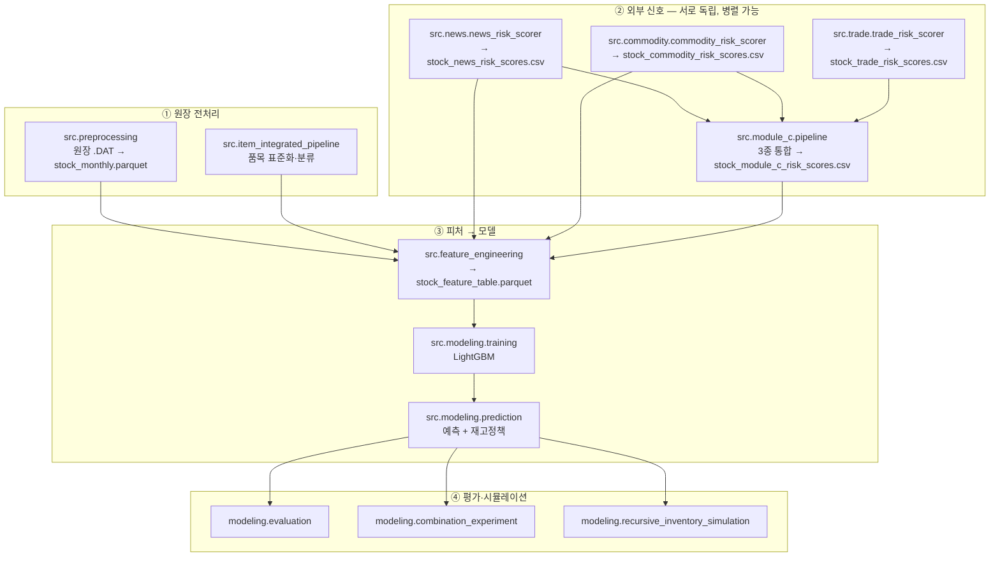

# 파이프라인 구성과 실행 상태

작성 2026-08-11. `README.md` 의 배치 순서를 의존 관계 관점에서 풀어 쓰고,
각 단계가 **지금 실제로 어떤 데이터로 돌아가는지** 를 함께 기록한다.

단계 목록만으로는 "돌긴 도는데 안에 뭐가 들었는지" 를 알 수 없어서 사고가
반복됐다. 이 문서는 그 두 가지를 한 곳에서 본다.

---

## 1. 전체 구조



### 합류 지점이 `feature_engineering` 이다

외부 신호는 여기서 `stock_item_key` + `year_month` 로 조인된다. **조인이 실패하면
0으로 채워지고 파이프라인은 성공으로 끝난다** (`_merge_risk()`). 이 설계가 아래
"반복된 실패 유형" 의 근원이다.

---

## 2. 각 층의 현재 상태

| 층 | 구성요소 | 상태 | 근거 |
|---|---|---|---|
| ① | 원장 | ✅ 정상 | 피처 5,190,767행 |
| ② | 원자재 | ✅ 실데이터 | Alpha Vantage 2015-01~, `data/external/market/commodity_prices.csv` (982KB). 피처 커버리지 22.4% |
| ② | 관세청 | ✅ 실데이터 | KCS OpenAPI 2018-01~2026-06, `data/external/trade/kcs_trade_*.csv` |
| ② | **뉴스** | ⏳ 수집 중 | 직전까지 **합성 96행**(`example.test` URL)이었다 |
| ③ | 모델 | ⏳ 튜닝 중 | 4-fold, 45/60 trial |
| ④ | 평가 | ⏸ 대기 | ③ 완료 후 |

### 뉴스만 상태가 다른 이유

GDELT DOC 2.0 API 의 `artlist` 모드가 **최근 3개월만** 서빙한다. 실측:

```
2024-01 요청 → 응답 250건 / 요청 창 안 0건 (실제 날짜 전부 2024-02-01)
2026-06 요청 → 응답 250건 / 요청 창 안 250건
```

따라서 학습·검증 구간(2024-01~2025-06)을 DOC API 로는 채울 수 없다. 대신 GKG
**원본 아카이브**(`data.gdeltproject.org`, 인증 불필요)에서 받는다.
자세한 내용은 PR #77.

---

## 3. 동시 실행 중인 작업

| 작업 | 자원 | 상태 |
|---|---|---|
| Optuna 튜닝 | CPU 4스레드 | 45/60 trial, best WAPE **37.0482** |
| GDELT 뉴스 수집 | 네트워크 8병렬 | 13,128 슬라이스 중 진행 |
| 조달청 리드타임 | 네트워크 | 6개월 확보, 일 할당량 소진으로 대기 |

튜닝(CPU)과 뉴스 수집(네트워크)은 자원이 겹치지 않아 병행한다.

### 튜닝 fold 구성

롤링 원점, 검증 총 12개월. fold 폭 3개월.

| fold | train_end | valid |
|---|---|---|
| 2024_q3 | 2024-06 | 2024-07~09 |
| 2024_q4 | 2024-09 | 2024-10~12 |
| 2025_q1 | 2024-12 | 2025-01~03 |
| 2025_q2 | 2025-03 | 2025-04~06 |

현재 fold 별 WAPE 36.26 / 37.82 / 36.91 / 37.12 — 편차 1.6%p 로 특정 분기에
쏠리지 않는다. fold 를 2개에서 4개로 늘린 목적이 작동하고 있다.

---

## 4. 뉴스 반영 시 재실행 경로

수집이 끝나도 아래를 다시 타야 피처에 반영된다.

```
.env 의 NEWS_DATA_PATH 교체
  → src.news.news_risk_scorer      (합성 fail-closed 게이트 통과 확인)
  → src.module_c.pipeline          (뉴스 성분 재계산)
  → src.feature_engineering        (피처테이블 재생성)
  → 변형 비교 A / E / B / C
```

### 예상되는 병목

`data/mapping/stock_item_material_mapping.csv` 가 **2,297행 전부
`polypropylene (PP)`** 단일이다. 뉴스를 몇 만 건 모아도 PP 외 원자재 기사는
연결될 품목이 없어 버려진다.

알루미늄은 수요비중 13.37%(PP 14.35%)에 Granger p=0.0033(PP 0.0123)으로 근거가
있으나 매핑에 없다. 확장 여부는 도메인 판단이므로 이슈 #22 에 의견을 요청해 두었다.

---

## 5. 반복된 실패 유형 — 조용한 성공

같은 패턴을 하루에 세 번 겪었다.

| 사고 | 증상 | 원인 |
|---|---|---|
| 모듈 C 조용한 0 | 스코어러 0행, exit=0 | `.env` 미로딩으로 provider 가 안 잡힘 |
| C 모델 "산출 불가" | 변형 실행 자체가 스킵 | 원자재 데이터 없던 시점 결과를 최신으로 오인 |
| 합성 뉴스 | A/B 결과가 무효 | 가짜 96행이 실데이터 자리를 차지 |

공통점은 **데이터가 없거나 가짜인데 파이프라인이 성공으로 끝난다**는 것이다.
`_merge_risk()` 가 조인 실패를 0으로 메우기 때문에 후속 단계가 아무 이상 없이
진행된다.

### 지금까지 붙인 방어막

- `.env` 자동 로딩 (PR #71)
- 외부 신호 커버리지 경고 로그 (`_log_external_signal_coverage`)
- 합성 뉴스 fail-closed 게이트 (PR #75)
- 조달청 수집기의 할당량 소진 즉시 중단
- GDELT `combined` 모드 제거 — 항상 실패하는 경로 삭제 (PR #73)

### 아직 없는 것

**피처테이블 생성 시점에 "이 신호는 비영 0%" 를 실패로 처리하는 게이트.**
지금은 경고만 남기고 학습이 그대로 진행된다. `--require-external-signals` 같은
엄격 모드가 후보다(PR #71 리뷰에서도 지적됨).

---

## 6. 실행 순서 요약

```
현재 ─┬─ 튜닝 완료
      └─ 뉴스 수집 완료
              ↓
        news_risk_scorer → 실제 매칭 건수 확인   ← 매핑 확장 판단 근거
              ↓
        module_c.pipeline → feature_engineering
              ↓
        변형 비교  A(사용량) / E(원자재) / B(뉴스) / C(뉴스+원자재)
              ↓
        조달청 리드타임 재개 (자정 할당량 리셋 후)
```

---

## 관련 문서·PR

- [방법론 근거 대장](2026-08-11_01_METHODOLOGY_EVIDENCE.md) — 각 설계 결정의 문헌 근거와 실측 수치
- PR #73 GDELT `combined` 제거 / #74 근거 대장 / #75 합성 뉴스 fail-closed
- PR #76 원자재 단독 변형 / #77 GKG 원본 아카이브 수집기
- 이슈 #22 뉴스 수집 경로 확정
