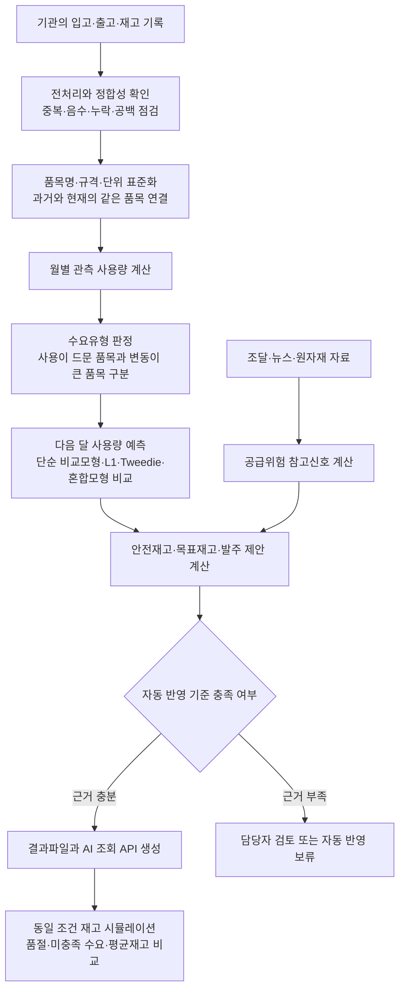
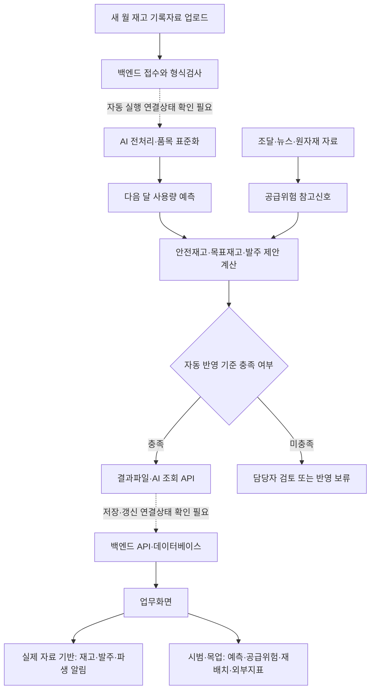

# 2026 사회보장 AI혁신 산학협력 프로젝트 최종 성과 보고서(본보고서 개정본)

## 1. 프로젝트 개요

- 참여과제명 : 보건소 필수의료물품 적정재고 예측 모형
- 협업 부서 : 한국사회보장정보원 보건의료정보부
- 참여대학 : 동국대학교
- 팀명 : Team_Lex
- 팀원 구성 및 역할 : 장준혁(팀장·개발 총괄), 조수행(PM·기획), 장세현(AI 총괄), 박나연(데이터 전처리·수요분석), 조민제(백엔드·DB)

---

## 2. 추진배경 및 목적

### 가. 추진배경

- **(대외 환경)** 중동 지역 분쟁 장기화로 나프타(원유에서 얻는 석유화학 기초원료) 등 원자재 공급이 불안정해지면서, 나프타에서 생산되는 폴리프로필렌(PP)을 주 재질로 하는 의료물품(주사기·수액세트·카테터 등)의 생산·수급 차질이 우려됨. 4-가(4)에서 주사기–PP를 검증 대상으로 삼은 근거가 이 경로임.
- **(관리·분석 공백)** 보건소는 PHIS(보건소통합정보시스템)로 재고를 관리하나 물품명을 임의 입력하는 비표준화 방식이어서 전국 통합 파악이 어렵고, 표준 분류체계와 수요예측 기반이 없어 재난·수급불안 시 품목별 적정재고를 판단할 근거가 부재함.

### 나. 추진 목적

- 보건기관별 입고·출고·재고 기록을 분석하여 다음 달 사용량과 필요한 재고량을 계산하는 모형을 개발함. 이를 통해 보건복지부의 재난·수급불안 대응과 보건기관의 통합 재고관리를 지원하고자 함.
- 재고 계산은 국내외 선행연구와 재고관리 교재에서 널리 사용하는 계산법을 바탕으로 구성함. 발주 제안은 사전에 정한 식과 규칙으로 계산하여 같은 입력에는 같은 결과가 나오도록 하였음.

---

### 다. 보고서에서 사용하는 주요 용어

전처리와 정합성처럼 데이터 분석과 정보시스템 업무에서 일반적으로 사용하는 용어는 그대로 사용하되, 처음 접하는 독자가 이해하기 어려운 용어는 다음과 같이 설명함.

| 용어 | 이 보고서에서의 뜻 |
|---|---|
| 재고 기록자료 | 기관이 업무 중 작성한 입고·출고·재고 내역. 기존 자료명에 포함된 ‘물품재고 원장’을 쉬운 말로 표현한 것임 |
| 품목 표준화 | 기관마다 다르게 입력한 품목명·규격·단위를 비교 가능한 형태로 정리하는 작업 |
| 문자 표기 통일(NFKC) | 전각·반각 문자처럼 사람이 보기에는 비슷하지만 컴퓨터가 다르게 인식하는 문자를 같은 형태로 맞추는 처리. 원래 품목명은 별도 보존함 |
| 주사침 굵기 규격(Gauge) | 주사침의 굵기를 나타내는 규격. 예를 들어 23G와 24G는 서로 다른 규격이므로 같은 품목으로 합치지 않음 |
| WAPE | 전체 실제 사용량을 기준으로 계산한 예측오차 비율. 낮을수록 전체 물량을 더 정확히 예측한 것임 |
| BIAS | 예측량이 실제량보다 전체적으로 많았는지 적었는지 나타내는 비율. 음수는 과소예측, 양수는 과대예측을 뜻함 |
| 단순 비교모형(Baseline) | 별도의 기계학습 없이 최근 평균 등 간단한 규칙으로 계산한 예측값. 개발 모형의 효과를 판단하는 비교기준임 |
| 별도 시험기간(Holdout) | 모형 선택과 설정에 사용하지 않고 마지막 성능 확인에만 사용한 기간 |
| 자동 반영 차단 기준(Gate) | 근거가 부족하거나 자료가 오래된 경우 계산 결과가 발주 제안으로 바로 전달되지 않도록 막는 확인 기준 |
| 품목 분류정보(메타코드) | 품목의 재질·규격·수요 특성·공급위험을 표시하여 서로 다른 자료를 같은 품목 기준으로 연결하는 정보 |

이후 본문에서는 우리말을 먼저 사용하고 필요한 경우에만 영문 약어를 함께 적었음. 수식과 모형 내부 설정은 재현성을 위해 본문에 남기되, 각 식이 답하려는 질문과 실제 업무상 의미를 함께 설명함.

---

## 3. 수행내용

### 가. 데이터 현황

#### (1) 활용 데이터

| 구분 | 규모 | 역할 |
|---|---:|---|
| 재고 기록자료 2024-01~2025-12(DAT 10개) | 일별 16,265,602행 → 월별 3,729,983행 | 수요예측 주 입력 |
| 재고 기록자료 2018-01~2019-12(DAT 3개) | 일별 6,106,936행 → 월별 1,460,785행 | 표준화·보조학습 |
| **원천 합계** | **22,372,538행** | |
| 약성분 | 358만 행(약품 80,934종) | 동일성분 대체품목 판별 |
| 조달청 나라장터 계약상 납품기간 | 수집 문서 31,898건 | 실제 입고기간을 직접 측정할 수 없을 때 사용하는 비교 기준 |
| 외부위험 | 국제 원자재 시세, 관세청 수출입, 뉴스, 식약처 공급중단 실적 | 공급위험 산정 |

- **(분석 단위)** 현재 구간은 기관 3,530개·부서 109개·물품코드 17,155종·시계열 416,128개, 과거 구간은 기관 1,553개·부서 89개·물품코드 11,795종임. 과거 구간의 기관 수가 적은 것은 2018~19년에 보건진료소 상당수가 별도 시스템을 사용해 제외되었기 때문이며 정의서에 명시된 사항임.
- **(단가 자료의 한계)** 구입단가는 현재 원천 16,265,602행 중 101,022행(약 **0.62%**)에서만 관측되어, 전 품목의 구매비용·보유비용·품절비용을 실제 금액으로 계산할 수 없었음.
- **(자료 시점)** 제공 자료는 운영 시점보다 약 8개월 이전 구간으로, 과거 시점을 재현해 평가하기 위해 설정된 조건임. 과거 검증에는 활용할 수 있으나, **산출된 발주량을 현 시점의 실제 발주량으로 그대로 적용하기에는 적합하지 않음**.

#### (2) 전처리 방법

**① 음수 출고의 처리** — 음수 출고는 실제 사용량이 음수라는 의미가 아니라 반품·입력취소·과거기록 정정에 따라 기록된 값으로 판단됨. 원자료의 값을 삭제하거나 양수로 바꾸지 않고 정상 출고와 조정 내역을 분리하여 보관함.

- 기록상 출고량 = Σ 정상출고량(부호 보존) / 모형 사용량 = Σ max(정상출고량, 0)
- 음수 거래건수 = 정상출고량이 0보다 작은 건수 / 음수 조정량 = Σ |min(정상출고량, 0)|
- 출고 4개와 정정 −4개가 함께 기록된 달은 기록상 합계가 0이지만 양수 출고 4개는 학습에 남김. −89만 기록된 달은 모형 사용량을 0으로 두고 반품·정정 89개는 별도 보존함
- 원자료 대사값과 학습값을 구분하기 위해 **본 과제에서 정한 처리 기준**이며 문헌상의 표준 공식은 아님

**② 관측 사용량과 실제 필요량의 구분** — 실제 필요량이 100개였더라도 재고가 60개뿐이었다면 전산 기록에는 실제로 사용된 60개만 남게 됨. 현재 자료에는 요청량·충족량·미충족량이 없으므로 **재고 기록자료에 관측된 양수 정상출고량을 필요수요의 대리값**으로 사용함. 따라서 본 보고서에서 사용하는 ‘수요’는 관측 사용량을 의미하며 잠재수요와 구분하여 해석할 필요가 있음.

**③ 품목명·규격·단위 정규화** — 여기서 정규화는 품목명·규격·단위·포장표현을 정리해 같은 물품인지 비교할 수 있게 만드는 **품목 표준화**를 의미함. 실제 사용량·입고량·재고량은 원 단위를 유지함.

- 원본 품목명 → 문자 표기 통일(NFKC)·공백·기호 정리 → 기관별 품목 식별키 생성
- 제조사·성분·제품명·제형·용량·함량·주사침 굵기 규격(Gauge)·포장수량·단위 분리
- 표기만 다른 이름을 대표품목으로 연결 → 품목군·계열·세부유형·규격·단위 후보 생성
- 공식 마스터·근거 사전 대조 → 확인 / 검토필요 / 연결불가 상태와 연결 신뢰도 부여

과거와 현재의 품목명이 완전히 일치하면 우선 연결하고, 포장표현·괄호를 제거한 핵심 이름이 같은 경우에는 **그 이름이 현재 표준품목 하나에만 대응할 때만** 연결함. EA와 ROLL, TABLET과 ML, 3mL와 5mL, 23G와 24G처럼 단위·규격이 다르면 합치지 않았음.

**④ 거래기록이 없는 날의 처리** — 재고 기록자료에는 거래가 발생한 날만 남으므로, 거래가 없는 날을 계산에서 빼면 하루 평균 사용량이 실제보다 크게 계산됨. 거래기록이 없는 날을 ‘사용량 0’으로 반영한 결과 일평균 사용량은 **12.77 → 1.95**로 조정되었고, 종전 값이 약 6.5배 크게 계산되었음을 확인함.

**⑤ 공백 구간 차단** — 2020~2023년은 미제공 구간으로 확인되어 보간하지 않고, 2019년과 2024년 사이에 별도 시계열 ID를 부여해 과거 값이 2024년 특성으로 이어지지 않도록 차단함.

#### (3) 데이터 품질 확보 방안

| 지표 | 결과 | 의미 |
|---|---:|---|
| 전체 로컬 품목 연결기록 | 585,279행 | 현재 409,519 + 과거 175,760 |
| 표준품목 | 125,557종 | 규격·단위를 포함한 감사·추적 단위 |
| 과거품목 학습 연결 | 146,757/175,760종 (**83.50%**) | 엄격 일치·핵심명 유일대응 연결만 사용 |
| 과거 미연결 격리 | 29,003종 | 이름 임시키를 학습에 넣지 않음 |
| 로컬키 중복 / 표준키·정의키 누락 | **0행 / 0행** | 감사키 완전성 게이트 통과 |
| 평균 연결 신뢰도 | 0.943 | 임시키 0.50을 포함한 평균 |

- **(격리의 의미)** 행을 삭제한 것이 아니라 같은 품목이라는 근거가 부족해 **모델 학습에서만 제외**한 것이며, 공식 대응표가 확보되면 재연결하도록 원본을 보존함.
- **(재고 기록의 정합성)** `기초재고 + 입고 − 출고 = 기말재고` 관계를 확인한 결과, 관계가 맞지 않는 기록은 2024~2025년 8행, 2018~2019년 39행이었음. 나머지 기록에서는 계산 관계가 일치함을 확인함.
- **(품목 분류표)** 재고품목에 `일회용 주사기`, `주사기 사용형 소모품`, `폴리프로필렌 관련` 등의 분류 표지를 부여하여, 과거자료·원자재·위험정보와 재고계산을 단계적으로 연결함. 대표품목 분류자료 101,546건 중 구체적 원자재 후보는 58,103건이었으나 대부분 추가 확인이 필요한 **후보** 상태이므로, 후보와 승인을 구분하여 해석하였음.

#### (4) 정보보안 제약과 산정 단위의 한계

제공 자료는 개인정보 보호와 정보보안 요건에 따라 일부 연결정보가 제외된 형태였음. 보건기관은 실명과 지역 없이 **익명 코드로만 제공**되었고(3,530개), 기관 마스터와 구입처 정보도 제공되지 않았음. 본 과제 역시 화면과 내보내기 자료에서 기관명을 표시하지 않고 익명 코드만 사용하도록 설계함.

이 제약 때문에 조달청 계약 건과 재고 기록자료의 입고 건을 **한 건씩 연결할 수 없었음**. 따라서 기관별·공급사별 실제 조달기간을 계산하지 못했고, 계약상 납품기간의 전체 분포에서 얻은 30일과 60일을 비교 기준으로 사용하였음. 목표 수요충족 수준을 안전재고로 바꾸는 값(z), 수요의 변동 정도(σ), 재고를 검토하는 주기(R)도 공통값 또는 정책값으로 두었음. 현재 계산의 세밀함은 모형 성능뿐 아니라 서로 다른 자료를 연결할 수 있는 식별정보의 범위에도 영향을 받음.

| 확보 조건 | 현재 | 확보 시 가능해지는 것 |
|---|---|---|
| 익명 기관코드 ↔ 운영 기관 대응표 | 기관·지역 축 분석 불가 | 기관 유형·지역별 수요·결품 패턴 분리 |
| 주문일·약속일·실입고일 | 계약 납기 30일 전 품목 공통 | 품목·공급사별 **실측 리드타임** |
| 구입처코드·구입단가 | 관측 0.62%, 금액 분석 불가 | 예산 환산·ABC 등급·경제적 발주량 |
| 요청량·충족량·미충족량 | 관측 사용량을 대리값으로 사용 | 실제 서비스 수준 측정 |

위 항목은 **이미 보유한 자료를 안전하게 연결할 수 있는 키**에 해당하며 자료의 양을 추가로 확보하는 사항은 아님. 개인정보를 추가로 노출하지 않는 **가명처리된 연계키** 형태로도 제공이 가능할 것으로 보임. 이 조건이 갖춰지면 현재 전체 공통값으로 둔 변수들이 품목·기관·공급사 단위로 개별화되어, 같은 알고리즘으로도 정밀도와 적용 범위가 함께 확대됨.

### 나. 분석 및 개발 방법론

#### (1) 설계 원칙과 전체 절차

본 과제는 자료 정비, 사용량 예측, 재고 계산, 결과 검증의 순서로 수행하였음. 각 단계에서는 선행연구의 계산법을 그대로 적용하지 않고, 필요한 입력값이 실제 자료에 존재하는지 먼저 확인하였음. 요청량·충족량 자료가 없어 결품 때문에 드러나지 않은 수요를 복원하는 단계는 수행하지 못했으며, 관측된 양수 출고량을 대신 사용하였음(3-가(2)② 참조).

이 절차가 답하려는 질문은 다음과 같음.

- 전처리와 정합성 확인: 기록 오류 때문에 수요와 재고가 잘못 계산되지 않았는가?
- 품목 표준화: 표기만 다른 같은 품목을 분리하거나 규격이 다른 품목을 잘못 합치지 않았는가?
- 수요예측: 단순 평균보다 다음 달 사용량을 더 정확히 계산하는가?
- 재고 계산: 예측오차를 고려했을 때 얼마를 보유하고 언제 발주해야 하는가?
- 외부위험 검증: 뉴스와 원자재 변화가 사용량을 바꾸는지, 공급지연 가능성을 높이는지 구분할 수 있는가?
- 자동 반영 기준: 근거가 부족한 계산 결과가 실제 발주 제안으로 전달되는 것을 막을 수 있는가?

#### (2) 핵심 산정식과 채택 근거

**① 수요유형 판정**

- *왜 필요한가* — 사용이 매달 발생하는 품목과 몇 달에 한 번씩 발생하는 품목에는 같은 안전재고 계산법을 일괄 적용하기 어려우므로 먼저 수요의 형태를 구분하였음.
- ADI(평균 수요발생 간격) = 전체 관측월 T / 양수 수요월 n₊
- CV²(변동계수 제곱) = (양수 수요 표준편차 s₊ / 양수 수요 평균 μ₊)²
- *근거* — Syntetos, Boylan과 Croston(2005)의 기준값(ADI 1.32 / CV² 0.49)으로 4분류한 결과 **간헐·간헐변동 수요가 72.37%**였음. 이는 다음 단계에서 어떤 계산법을 적용할 수 있는지 판단하기 위한 진단 결과이며 예측 성능지표가 아님

**② 재고정책 — 정기검토(R,S)**

- *왜 필요한가* — 기관이 재고를 일정한 주기로 검토하므로 다음 검토일까지의 수요와 납품을 기다리는 기간의 수요를 함께 고려해야 함
- 보호기간 H = 검토주기 R + 리드타임 L
- 보호기간 예상수요 = 월 예측수요 × H / 30
- 안전재고 = z × σ × √(H / 30)
- 목표재고 S = 보호기간 예상수요 + 안전재고
- 재고포지션 = 현재고 + 주문 중 수량 − 미공급 수량
- 제안발주량 = max(목표재고 − 재고포지션, 0)
- *근거* — Silver 등(1998)의 정기검토 재고정책을 참고함. 발주가 월 1회 이루어진다는 기관 확인에 따라 검토주기 R을 30일로 두었음
- *예시* — 검토주기와 계약상 납품기간이 각각 30일이고 월 예상 사용량이 100개일 때, 현재고와 주문 중 수량을 뺀 부족분을 제안발주량으로 계산함. 이 예시에서는 176.5개가 산출되며 실제 발주 시에는 포장단위와 담당자 판단을 추가로 반영해야 함

**③ 목표 수요충족 수준을 안전재고로 바꾸는 값(z)**

- 본 과제는 `z = 1.645`를 사용함. 이는 약 95%의 수요충족 수준을 목표로 할 때 사용하는 값임
- 비용 임계비율 p\* = 부족비용 Cu / (부족비용 Cu + 과잉재고비 Co)
- z\* = 표준정규분포에서 p\*에 해당하는 위치값
- z가 커지면 품절 가능성은 낮아질 수 있으나 보유재고와 비용은 증가함. 부족비용과 과잉재고비가 제공되지 않아 95% 수준을 임시 정책값으로 사용했으며, 비용자료를 확보하면 다시 계산해야 함

**④ 리드타임 L**

- 리드타임은 발주 후 물품을 받기까지 걸리는 기간을 뜻함. 현재 자료에는 실제 입고일이 없어 아래 값은 **계약서에 정한 납품기간**이며 실제 소요일이 아님
- 계약상 리드타임 = 납품기한(maxDlvrTmlmtDate) − 납품요구접수일(dlvrReqRcptDate)
- 2024년 상반기 10,255건 중 유효 10,109건에서는 30일이 가장 흔했고 상위 10% 지점이 60일이었음. 24개월 수집 문서에는 원자료 31,898건, 실행 코드에는 유효 30,815건이 기록되어 있으므로 최종 제출 전 제외 사유와 건수 흐름을 실행 명세로 대조해야 함. 유효자료의 중앙 구간은 30일, 상위 10% 지점은 60일, 상위 5% 지점은 94일이었음
- 30일은 가장 흔한 계약기간이므로 기본 비교값으로 사용하였음. 공급위험 등급에 따라 30일·60일·94일을 선택하는 정책 시나리오를 구성했으나, 전체 품목의 실제 입고기간이 30일이라는 뜻은 아님. 실제 발주일·약속일·입고일을 확보하면 품목·기관·공급사별로 다시 계산해야 함

**⑤ 외부위험 점수**

- 기사점수 = exp(Σ αk × log wk), Σαk = 1 (wk는 평가항목별 점수, αk는 그 가중치)
- 월별 뉴스위험 = 1 − exp(−기사점수 합계 / 기준척도)
- 복합위험 = 1 − Π(1 − 원인별 위험) — 두 위험이 0.4와 0.3이면 복합위험 0.58
- 기사점수는 사건 심각성·출처 신뢰도·품목 관련성·최근성·반복기사 여부·품목 노출가능성을, 원자재는 가격변화·30일 변동성·장기평균 대비 가격·1·2개월 시차·3개월 지속위험·급등락을 사용함
- **이 값은 신호가 평소보다 얼마나 강했는지를 나타내는 비교용 점수**이며, 사건 발생확률이나 품절확률은 아님. 중복 계상을 막기 위해 동일 원인군 내에서는 최댓값만 취하고 서로 다른 원인군 사이에서만 결합함

**⑥ 공급위험에 따른 동적 리드타임·안전재고**

- PP 공급위험 R_PP = PP 가격위험 × (0.35 / 0.45)
- 공급위험 반영 리드타임 = 30 × (1 + 0.5R) + 14R = 30 + 29R
- 공급위험 안전재고 = z(R) × σ × (1 + 0.5R) × √((검토주기 + 반영 리드타임) / 30)
- *계수의 의미* — 공급위험은 `0.45 × 공급차질 뉴스 + 0.20 × 원자재 뉴스 + 0.35 × 시장가격`으로 산정하며, PP는 가격 신호만 존재하므로 **가격 가중치 0.35를 최대 가중치 0.45로 나누어 0~1 척도로 환산**함. 평가기간 평균 PP 가격위험 0.1858은 이 환산을 거쳐 공급위험 0.1445가 되며, 이 값이 평균 유효 리드타임 34.19일로 이어짐. 0.5와 14일은 리드타임 배수와 추가 일수의 상한이며, 실제 입고 지연 자료가 확보되면 재산정할 수 있음

#### (3) 평가지표와 검증 설계

- WAPE = Σ|실제 − 예측| / Σ|실제| × 100 (낮을수록 정확)
- BIAS = Σ(예측 − 실제) / Σ실제 × 100 (부호는 손실이 발생하는 방향을 나타냄)
- RMSE = √평균(실제 − 예측)² (큰 오차에 더 큰 가중치를 부여함)
- *채택 근거* — MAPE(평균절대백분율오차)는 실제수요가 0인 구간에서 값이 발산하므로 0수요 비율 24.4%인 본 자료에 부적합함. 반면 WAPE는 물량이 많은 품목의 오차를 더 크게 반영하여 재고 관점과 부합함. BIAS를 별도로 보는 것은 **부호가 서로 다른 손실**을 뜻하기 때문임(음수=과소예측·결품 위험, 양수=과잉재고·폐기 위험)
- 성능 판정은 **같은 행·같은 기간의 단순 기준예측과 대비**하는 상대평가 방식으로 수행함. 품목별 수요 특성과 0수요 비율에 따라 동일한 지표값도 의미가 달라지므로, 동일 조건의 기준선과 비교하는 방식이 본 자료에 적합하다고 판단하였음

| 구간 | 기간 | 규모 | 용도 |
|---|---|---:|---|
| 학습 | 2018~19 표준매칭분 + 2024 전체 | 952,002 + 1,383,361행 | 모형 학습 |
| 검증① | 2025-01~06 | 704,421행 | 과거자료 반영 비중 결정 |
| 검증② | 2025-08~09 | 246,102행 | 모형 배합 결정 |
| 재사용 평가 | 2025-10~12 | 359,335행 | 편향·재고정책 진단 |

- **(사용 알고리즘)** 수요예측에는 **LightGBM**을 사용함. 의사결정나무를 순차적으로 추가하면서 직전 단계의 오차를 줄여 나가는 기울기 부스팅 계열 알고리즘으로, 범주형 변수와 결측이 많은 표 형태 자료에서 학습이 안정적임. 학습 시 오차를 무엇으로 정의할지(목적함수)를 달리하면 동일한 자료에서도 성격이 다른 예측값이 산출되므로, 본 과제는 아래 두 가지를 함께 운용하였음
  - **L1(절대오차)** — 예측값과 실제값 차이의 절댓값 합을 최소화하는 목적함수로, 통계적으로는 조건부 중앙값을 추정함. 0수요가 많은 자료에서는 중앙값이 낮게 형성되므로 WAPE에는 유리하나 총량을 적게 예측하는 경향이 있음
  - **Tweedie** — 0이 자주 나타나면서 0보다 큰 값은 연속적으로 분포하는 자료를 하나의 확률분포로 설명하는 방식임(복합 포아송–감마 분포, 분산지수 1<p<2). 예측값이 음수가 되지 않으며, 사용이 없는 달과 대량 출고가 섞여 있는 간헐 수요 자료에 적합함
- **(모형 구조)** 두 목적함수를 대체 관계가 아니라 역할 분담 관계로 두었음. L1은 전체 정확도(WAPE)에, Tweedie는 총량편향과 큰 오차의 억제에 각각 유리하여 **정확도와 결품위험이라는 서로 다른 목적**에 대응하며, 절충안으로 `혼합 = L1비율 × L1 + Tweedie비율 × Tweedie`를 함께 비교함
- **(예측에 사용한 정보)** 사용량의 과거값과 이동평균, 사용 간격, 입고·기말재고·품절률·폐기량, 월과 계절, 익명 기관·부서·대표품목, 재고 기록의 품질 등 51개 항목을 사용함. **예측하는 시점에 아직 알 수 없는 평가월 실제 사용량과 기말재고는 입력하지 않았음**
- **(개발환경)** 분석·학습은 Python(pandas·pyarrow·scikit-learn·LightGBM·Optuna)으로 수행하고 산출물을 PostgreSQL 운영 DB에 적재함. 업무 콘솔은 FastAPI 기반 REST·GraphQL API와 Next.js 화면으로 구성하며, 저장소별 자동화 테스트를 CI에서 실행함

### 다. 추진일정 및 수행 경과

- **6월~7월 중순** — 산정식 확정, 3개 모듈 파이프라인 통합, 품목 마스터 키를 표준물품명으로 확정(7.14.)
- **7.23.** — 기관 리뷰회의 지적 반영, '긴급 부족' 오탐 정밀화
- **7월 말** — 3차 데이터 수신·전수 검증, 시계열 3분할 검증 도입, 업무 콘솔 반영(중간 점검)
- **8.14~15.** — 계약상 납품기간 기준 확보 및 비교 적용, 모형 설정값 최적화, 품목 중요도 등급 설계
- **8.17~19.** — 외부위험 재실험, 편향보정 재고검증, 주사기–PP 공급위험 분석, 재현성 명세 생성

중간 점검 시 "정책 확정 후 반영 예정"으로 남겨 두었던 리드타임 항목을 이후 구간에서 완료하였음.

---

## 4. 주요결과

### 가. 분석 결과

#### (1) 오탐 경보 분리

재고가 0이어서 ‘긴급 부족’ 경보가 발생한 128,250건을 미운영·자료누락·실제결품으로 나누는 규칙을 전체 재고 기록자료에 적용함. 그 결과 **63,930건(약 50%)을 오탐 가능성이 있는 경보로 분리**하였음(2026.7.28. 운영 DB 반영). 해당 기록의 발주 제안 1,193,632개는 해제하였고 변경 전 상태는 백업함. 다만 자료누락으로 분류되었더라도 최근 3개월 사용기록이 있는 885건은 담당자 확인 대상으로 남겼음.

#### (2) 계약상 납품기간 기준값 확보와 비교 시나리오 적용

- 재고정책 계산 대상 409,459행에는 당시 공급위험 등급에 따라 30일 308,452행, 60일 101,007행을 적용했으며 미산정 행은 없었음. 정책설계에는 94일 기준도 있으나 해당 실행본에서 94일을 적용받은 행은 없었음
- 이 값은 ‘서비스 수준’이나 품목별 실제 입고기간을 예측한 결과가 아니라, 연결 가능한 실제 주문·입고 자료가 없을 때 사용한 계약상 납품기간 기준임
- 리드타임을 변경하면 안전재고·재발주점·목표재고·발주 제안도 함께 달라지므로 같은 계산 과정에서 모두 다시 산출하였음
- **변경의 영향** — 기본 비교값을 15일에서 30일로 바꾸면 보호기간은 45일에서 60일이 됨. 계산상 예상수요는 33.3%, 안전재고는 15.5%, 목표재고는 약 30.4% 증가함. 이는 종전 15일이 보호기간을 짧게 계산했을 가능성을 보여 주는 민감도 결과이며, 실제 품절이 그만큼 감소했다는 실증 결과는 아님

#### (3) 외부위험의 수요효과·공급효과 분리 검증

외부위험은 수요를 늘리는 방향과 공급을 지연시키는 방향 두 가지로 작용할 수 있으므로, 두 경로를 분리하여 각각 검증하였음.

**실험에 앞서 자체 검증에서 확인한 결함을 먼저 조치하였음.** 초기 예측자료에는 외부위험 15개 열(뉴스 4·원자재 3·외부위험 산정 모듈 8)이 있었으나 0이 아닌 값이 한 건도 없었음. 실제 위험이 없었던 것이 아니라 **외부위험 점수파일이 예측자료 생성과정에 연결되지 않은 결함**이었으며, 전 구간을 재연결한 뒤 아래 실험을 다시 수행하였음.

2024년 3분기~2025년 2분기 4개 시간구간, 총 1,403,923건 대상 대조실험 결과임(월 블록 부트스트랩 500회).

| 후보 | WAPE | 기준 대비 | 95% 구간 | BIAS | 판정 |
|---|---:|---:|---|---:|---|
| 수요전용 L1 | 36.966% | 기준 | — | −6.361% | 기준 |
| 뉴스 | 36.957% | −0.009%p | −0.072~+0.042 | −6.652% | 유의하지 않음 |
| 원자재 | 36.865% | −0.101%p | −0.183~−0.047 | −6.588% | WAPE 개선·편향 악화 |
| 뉴스+원자재 | 36.938% | −0.028%p | −0.096~+0.033 | −6.615% | 유의하지 않음 |
| 충격 잔차 보정 | 36.966% | 0에 가까움 | — | −6.361% | 변화 없음 |

※ 위 표는 외부위험 실험 전용 구간(2024.3분기~2025.2분기) 값이므로, 평가 구간이 다른 4-나(1)의 대표값(WAPE 35.714%·BIAS −9.617%)과 절대 수치를 직접 비교하지 않음. 이 표의 목적은 같은 구간 기준선 대비 증감 확인임.

- 외부신호 연결 표본은 7,544행, 강한 충격 표본은 3,166행으로 전체의 0.54%·0.23%에 불과함. 다만 **강한 충격 3,166건 구간에서는 WAPE가 42.479% → 41.837%로 0.641%p 개선**되었음. 별도 신뢰구간을 산출하지 않아 채택 판정에는 사용하지 않았으나 결과를 그대로 기록함
- **주사기 품목만 별도로 분석한 결과도 동일함** — 연결행 7,544건은 전부 일회용 주사기–PP 경로였고, 주사기 전체 11,873건·12개월에서 WAPE는 41.223% → 41.101%로 0.122%p 낮아졌으나 95% 구간이 −0.330~+0.105로 0을 포함했고 BIAS는 −4.848% → −5.389%로 악화됨. 같은 품목 안에서 **원자재 위험과 다음 달 사용량의 상관계수는 0.012로 0에 가까움**
- **같은 방식으로 기각한 검토 항목** — ① 기관 가명코드에서 추출한 시도·시군구 2단계 계층을 파생변수로 투입 → 예측 성능의 증분 없음, ② 계약 변경차수와 납기 연장의 관계 → 전수 자료에서 성립하지 않음, ③ 예측값 배율 보정 3종 → 충족률은 오르나 같은 재고를 안전계수 상향으로 확보하는 편이 전 구간에서 우세

따라서 '원자재 가격 상승 → 의료소모품 사용량 증가' 경로는 **채택하지 않았음**. 이는 외부위험의 역할을 수요효과와 공급효과로 분리하여 확인한 결과이며, **효과가 확인되지 않은 실험도 코드·산출물과 함께 저장소에 기록하였음**.

#### (4) 원자재 공급위험 — 추진배경의 직접 검증

본 절의 취지는 PP 가격이 주사기 수요를 늘린다는 점을 입증하는 데 있지 않고, **PP 공급위험을 모든 의료소모품에 일괄 적용하지 않고 재질 근거가 확인된 주사기 품목에만 전달되도록 통제**하는 데 있음.

아래 조건을 모두 충족하면서 단순 추정이 아닌 **직접부품 관계**로 확인된 경우에만 주사기–PP가 직접 관련이 있다고 인정하였음 — ① 일회용 주사기 품목군·주사기 사용형 세부유형 해당, ② PP 재질 근거 존재, ③ 품목군–원자재 관계 충돌 없음, ④ 관련 시장가격 자료 존재, ⑤ 추가검토 필요한 공급정책 오류 없음. 연결 심사 입력 11,383건 중 **2,212건**이 통과해 기관·부서별 재고품목 **2,297개**로 전개되었고, 평가기간에는 **975개 품목·3,300 품목-월**이 사용 가능했음.

| 지표 | 기준 | PP 공급위험 반영 시나리오 | 변화 |
|---|---:|---:|---:|
| 평균 유효 리드타임 | 30.00일 | **34.19일** | +4.19일 |
| 안전재고 합계 | 29,727.32 | 34,707.91 | **+16.75%** |
| 목표재고 합계 | 98,991.65 | 108,763.79 | +9.87% |
| 자동 권고 차단 규칙 적용 후 제안발주량 | 5,574.20 | 6,783.13 | **+21.69%** |

- 월별로는 PP 가격위험이 높았던 2025년 9월에 유효 리드타임이 최대 36.53일까지 오르고 안전재고가 26.54% 증가한 반면, 위험이 낮았던 10월에는 32.55일·10.15%에 그쳐 **위험 수준에 비례해 반응하는 구조**임을 확인함
- 이 결과는 수요 증가를 가정하지 않음. 같은 예측수요에서 PP 가격·변동성 상승을 공급차질 위험으로 보고 보호기간·안전재고를 상향했을 때의 **정책 민감도**이며, 실제 적용에 앞서 필요한 추가 재고·예산·보관공간의 범위를 검토하기 위한 **시험 계산**임. **즉시 발주량을 21.69% 상향한다는 의미는 아님**. 차단 규칙 적용 후 실제로 발주량이 증가한 행은 3,300 품목-월 중 **118행**이며, +21.69%는 이 118행에 집중된 증가분임
- 구매단가·입고일·결품원인 자료가 없어 인과효과는 주장하지 않고 운영 반영은 비활성 상태로 유지하며, 승인 매핑이 없는 주사침·혈관카테터에는 동일 효과를 주장하지 않음

#### (5) 자동 권고 차단 규칙

근거가 부족한 행이 발주권고로 전달되는 것을 차단하기 위한 규칙이며, 성능지표에 해당하는 항목은 아님.

- 장기 무수요·미운영 → 제안발주량 0
- 자료누락·오래된 관측 → 자동 산출값을 제시하지 않고 담당자 검토로 전환
- 품목·원자재 연결 충돌 → 외부위험 반영 차단
- 외부위험 독립검증 미통과 → 기본 제안발주량 유지
- 승인 동등품 재고 존재 → 긴급부족 표시 억제

PP 시나리오 3,300행에 적용한 결과 자동 계산 가능 **1,579행**, 장기 무수요·미운영으로 발주량 0 처리 **1,104행**, 자료누락·관측지연으로 담당자 검토 **617행**으로 분류됨. 표준화가 완료된 품목이라 하더라도 전부를 자동화 대상으로 삼지는 않았으며, **무인 자동발주는 어떤 품목에도 적용하지 않았음**.

#### (6) 그 밖에 수행한 분석

- **품목 중요도 등급** — 사용량·금액 축으로 ABC 등급을 산정하고 VED(필수·중요·일반) 판정 검토 목록을 작성함(기관의 공식 중요도 기준이 없어 검토안으로 남김)
- **검토주기 R의 품목별 실측** — 정책값 R=30일과 별도로 입고 간격에서 품목별 실측 R을 산출해 대조함
- **안전재고 산출 단위 재설계** — 현행 기관×품목 단위는 409,196개 그룹의 이력 중앙값이 6개월(12개월 이상 32.7%)로 표본이 부족함을 실측했고, 기관×품목계열로 묶으면 이력이 중앙값 14개월로 늘지만 변동성이 커지는 상충관계를 확인함
- **외부 공공자료 연계** — 관세청 무역위험은 HS코드(국제 통일 품목분류) 매핑 후보 14건을 승인해 커버리지를 30.7% → 38.3%로 확대했고, 식약처 공급중단 실적은 본 사업 품목과 연결되는 사례가 거의 없어 약성분 축에서만 일부 연결됨
- **동일성분 대체** — 약품코드 마스터 80,934종으로 성분 단위 동일군을 구성해 결품 시 대체품목 제시 근거를 마련함

### 나. AI모델 개발 결과

#### (1) 수요예측 성능

모형 구조는 3-나(3)과 같으며, 아래 표는 2025년 8~12월 605,438행을 같은 시점과 조건으로 고정하여 비교한 결과임.

| 모형 | WAPE | BIAS | RMSE | 역할 |
|---|---:|---:|---:|---|
| 최근 3개월 평균 | 40.022% | −6.040% | 201.315 | 최우수 단순 기준예측 |
| **수요전용 L1** | **35.714%** | −9.617% | 206.591 | **주모형** |
| 시간순 혼합 | 35.726% | −7.839% | 199.341 | 기존 도전모형 |
| 수요전용 Tweedie | 37.272% | **−1.971%** | **188.642** | 편향 도전모형 |

- 표의 **주모형**은 현재 대표값으로 채택한 모형을, **도전모형**은 다음 자료에서 대체 여부를 추가로 검증할 대안을 뜻함
- 단순 기준예측 대비 **4.31%p 개선**임. 학습을 거치지 않은 기준예측 6종 가운데 오차가 가장 큰 것은 '전년 같은 달'(52.674%)로, 의료물품 수요가 계절성만으로는 설명되지 않는 것으로 나타남
- **목적에 따라 우수한 모형이 달랐음** — L1은 전체 오차가 가장 작으나 과소예측이 컸고, Tweedie는 WAPE가 높으나 과소예측과 큰 오차가 훨씬 적었음
- 화면에 적용되는 수요율도 정적평균(WAPE 49.9%)에서 직전 3개월 이동평균(42.6%)으로 먼저 교체하여 반영하였음

#### (2) 품목 표준화가 성능에 기여한 정도

동일한 L1 구조에서 엄격 매칭된 2018~19년 자료 952,002행을 편입한 효과를 측정한 결과임(2025.1~6 검증구간).

- 현재자료 전용 **39.223%** → 과거자료 포함 **37.246%**, 개선 **−1.977%p**
- 가중치는 검증 구간에서만 선택하고 시험 구간은 선택에 사용하지 않았음
- **연결이 확인된 83.50%만 사용해 얻은 결과**이며 과거자료 전체가 유효하다는 의미는 아님. 품목 표준화 작업이 선행되었기에 확보할 수 있었던 개선분임

#### (3) 모형 설정값 최적화 — 3단계 검증 결과

- ① 탐색 구간(교차검증 분할) WAPE 38.587 → 36.961 (**−1.626%p**)
- ② 시험 구간(탐색 미사용) WAPE 38.121 → **35.676 (−2.444%p)**, BIAS −11.67% → −9.42%
- ③ 재고 성과 충족률 94.45% → **95.18%**
- 모형 설정에 사용하지 않은 별도 시험기간에서도 WAPE가 2.444%p 개선되어, 탐색 구간에만 맞춰진 결과일 가능성은 낮아졌음. 다만 한 번의 시험만으로 과적합이 없다고 단정할 수 없으므로 신규 월 자료에서 같은 설정으로 반복 확인해야 함
- 재고가 1.29% 증가하여 개선에 따른 부담이 함께 발생하였음. 같은 양의 재고를 안전계수 상향으로 확보했을 때의 충족률 94.53%와 비교하면 그 차이 **+0.656%p**가 순수 예측 개선분임
- ※ ③의 충족률은 77,575 시계열·보호기간 2개월·z=1.645·2025.7~11 조건이며 아래 (4)와 조건이 달라 직접 비교하지 않음. ②의 35.676%는 최적화 검증 시점 실행값이고 대표값은 (1)의 35.714%임

#### (4) 편향과 결품의 상충관계

정확도가 가장 높은 L1은 과소예측 편향(−9.617%)이 커서 결품 위험을 높이는 요인이 됨. 재사용 평가(2025.10~12, 359,335행)에서 L1은 WAPE 35.703%·BIAS −7.592%, 고정 5:5 결합안은 WAPE 36.180%·BIAS −3.920%로 **WAPE를 0.477%p 희생하는 대신 BIAS를 3.672%p 개선**함. 아래는 예측모형 외 조건(평가기간·품목·시작재고·검토주기 30일·통제 리드타임 30일·서비스계수·주문 도착시점)을 모두 동일하게 두고 **91,716개 시계열**로 수행한 재고 시뮬레이션임.

| 예측기 | 충족률 | 품절 품목-월 | 평균 월말재고 | 총 발주량 | 미충족 수요 |
|---|---:|---:|---:|---:|---:|
| L1 100% | 97.969% | 2.382% | **976.60** | **14,176,641** | 945,632 |
| 시간순 혼합 | 97.996% | 2.327% | 977.20 | 14,299,374 | 932,923 |
| L1 50% + Tweedie 50% | 98.020% | 2.282% | 977.72 | 14,451,946 | 921,838 |
| Tweedie 100% | **98.047%** | **2.224%** | 979.18 | 14,785,838 | **909,452** |

5:5 결합안은 L1 대비 발주량 1.94% 증가를 대가로 **미충족 수요 2.52% 감소**, 충족률 0.051%p·품절 품목-월 0.100%p 개선을 보임. 변화의 크기가 작아 품절 문제가 해소되었다고 보기는 어려움. 평가기간을 이미 반복 확인하였으므로 최종 확정모형으로 두지 않고 **신규 월에서 비율을 바꾸지 않고 확인할 도전모형**으로 분류하여 '검증 완료·운영 미적용'으로 표시함.

#### (5) 정확도 지표와 재고성과의 관계

(4)의 표에서 **WAPE 1위인 L1이 충족률과 미충족 수요에서는 최하위**임. 이는 조건을 달리한 검증에서도 반복적으로 관측되는 현상임. 아래는 (4)와 시계열 집합·기간이 다른 별도 검증(77,575 시계열, 2025.9~12) 결과이며, 재고·품절 수치의 절대 수준은 (4)의 표와 직접 비교하지 않음.

- 학습을 거치지 않고 최근값 등으로 계산한 단순예측(코드명 `naive`)은 WAPE 4위이나 충족률은 3위로 **순위가 역전**됨
- 미래를 모두 아는 완전예측의 평균재고가 195.4로 현행 모형 171.4보다 **높음** → 현행 모형의 낮은 재고 수준은 **과소예측으로 품절이 함께 증가한 데 따른 결과**로 해석되며, 운영 효율이 높아서로 보기는 어려움(품절 품목-월 7.92% vs 3.53%)
- 수요유형별로는 전체 기간 사용량이 0인 유형(코드명 `all_zero`)의 WAPE가 50.01로 가장 높았지만 품절 품목-월은 0.11%로 가장 낮았음. 반면 사용량이 크게 들쭉날쭉한 유형(코드명 `erratic`)은 WAPE 45.07, 품절 10.28%로 가장 위험했음. 즉 **예측오차가 큰 구간과 실제 품절위험이 큰 구간은 서로 달랐음**
- 이 결과는 Theodorou, Spiliotis와 Assimakopoulos(2025, *EJOR*)가 M5 자료에서 제시한 연구와 방향이 같음. 다만 자료와 재고정책 조건이 다르므로 선행연구 결과가 그대로 재현되었다고 단정하지 않고, 예측오차와 재고성과를 함께 평가해야 한다는 점을 확인한 것으로 해석함

**본 과제의 판단** — 대표 모형은 WAPE 기준 L1로 두고 재고성과를 병기하는 방식을 택함. 후보 간 재고성과의 차이가 작고(충족률 0.078%p), **품절 1건의 손실액과 재고 1개의 보유비용을 알 수 없는 상태에서는 그 차이가 발주량 1.94% 증가에 상응하는 효과인지를 판정하기 어렵기 때문**임. 1차 지표를 충족률·품절률·평균재고로 전환하는 안은 **비용 자료 확보 후의 과제로 남김.**

#### (6) 해석 시 유의사항

위 수치는 전체 물량 기준 평균 정확도이며 개별 품목의 정확도 보증값이 아님. 중간 점검 시 보고한 WAPE 37.184%·BIAS −3.467%는 2025.10~12 구간에 대한 당시 모형(수요유형별 앙상블)의 값으로, 본 보고서의 35.714%와는 평가 구간·행수·모형 설정이 모두 달라 직접적인 전후 비교로 사용하지 않음. 당시 모형은 예측행과 모형 번들이 보존되지 않아 완전 재현이 불가능함.

### 다. 서비스 구현 결과와 현재 범위

서비스 구현 결과는 실제 자료로 동작하는 기능, 코드가 있으나 연결상태를 추가로 확인해야 하는 기능, 시범화면 또는 목업으로 구분하였음. 이 구분 없이 화면 존재만으로 운영 완료라고 표현하지 않았음.

| 구분 | 확인된 범위 |
|---|---|
| AI 저장소에서 구현 | 전처리, 품목 표준화, 사용량 예측, 공급위험 계산, 재고정책 계산, 품질검사, 결과파일 생성, 조회용 API |
| 백엔드에서 구현 | 로그인·권한, 파일 접수, 데이터베이스, REST·GraphQL API, 재고·발주 관련 기능 |
| 프론트엔드에서 구현 | Next.js 기반 재고·자료·알림·관리 화면 |
| 시범·목업 표시 필요 | 수요예측, 공급위험, 재배치 제안, 외부지표 관련 일부 화면과 데이터 |
| 추가 확인 필요 | 새 월 자료 업로드부터 AI 재실행, 데이터베이스 저장, 화면 갱신까지 자동으로 이어지는 전체 연결 |

- **(산출 근거 표시)** 발주 제안과 함께 계약상 납품기간 출처, 적용 기준, 근거 표본 수, 보호기간과 예상 입고일을 표시하는 기능을 마련함
- **(선별 기능)** 재고 0의 원인, 판정 제외 사유와 예측 근거를 별도 항목으로 제공하여 담당자가 확인 대상을 좁힐 수 있도록 구성함
- **(식별정보 보호)** 기관 식별정보는 화면과 내보내기 자료에서 익명 코드로 표시하도록 전환 중임
- **(해석 원칙)** REST·GraphQL은 백엔드의 통신 방식이고 Next.js는 화면 구현 기술임. 본문에서는 기능을 중심으로 설명하고 기술명은 구현 근거로만 병기함

---

## 5. 검증 결과 및 정책 활용 제안

### 가. 업무 개선 효과

- **(경보 정밀화)** 오탐 경보와 이에 연동된 발주권고를 분리하여 **담당자가 확인해야 할 경보가 128,250건에서 64,320건으로 약 50% 감소**하였고, 실제 결품 건에만 집중할 수 있게 됨. 판정 제외 품목을 결품 집계에서 분리하여 지표가 왜곡되는 요인도 함께 제거함.
- **(계약상 납품기간 기준 정비)** 종전 15일 고정값을 조달계약 분포에 근거한 30일·60일 기준으로 바꾸어 보호기간을 지나치게 짧게 계산할 가능성을 줄였음. 다만 실제 주문부터 입고까지의 기간을 측정한 결과가 아니며, 품절 감소 효과도 아직 실증하지 못했음.
- **(계산 재현성 검증)** 문서 산정식과 시스템 저장값을 대조하여 안전재고·재발주점·목표재고·발주권고·상태 5개 항목이 전부 일치함을 확인함(오차 소수 반올림 수준). 입력 파일 해시·행수·스키마를 기록한 재현성 명세로 제3자 재검산이 가능하며, 정의서 대조·항등식·중복키 검증은 적재 파이프라인의 상시 게이트로 편입하고 자동화 테스트를 CI에서 실행함.
- **(검증 신뢰성)** 성능 판단 기간을 학습·가중치 선택 과정에서 분리하여, 평가 구간의 정보가 모형 선택에 반영되지 않도록 설계함. 효과가 확인되지 않은 실험과 자체 점검에서 발견한 결함도 결과를 그대로 수록함.

### 나. 정책활용 가능성

- **(현행화 체계)** 현재 산출값은 2025년 12월까지의 재고 기록자료를 기준으로 함. 실제 현장 적용에는 같은 형식의 최신 월 자료와 재계산이 필요함. 월 자료 접수 기능은 있으나 AI 전 과정이 자동으로 다시 실행되고 화면까지 갱신되는 연결은 추가 확인이 필요하므로, 이를 완료된 기능이 아니라 연계 과제로 제시함.
- **(자원 재배치)** 재배치 제안 화면은 과잉 가능성이 있는 기관과 부족 가능성이 있는 기관을 비교하는 시범기능임. 실제 이동 승인·운송비·유효기간·기관 간 책임절차가 확인되지 않았으므로 폐기량이나 조달비용이 실제로 감소했다고 표현하지 않음.
- **(현장 확산)** 재현 가능한 규칙형 근거와 화면 내 산출근거 표시를 갖추었으므로, PHIS 연계가 이루어지면 보건소·지소·진료소 통합 재고관리와 기관 간 표준 비교가 가능함.
- **(수급위험 대응 — 설계 단계)** 원자재 시장 변동을 공급차질 신호로 환산해 리드타임·안전재고를 선제 상향하는 경로를 설계·검증하였음. 다만 계수가 실입고 자료로 검증되지 않아 **현재는 운영에 적용하지 않으며**, 실측 자료 확보 후 재추정을 거쳐야 재난 대응 근거로 활용할 수 있음.

**(추가 발전 방안)** 현재 확인된 제약과 해당 자료가 확보될 때 가능해지는 것을 함께 제시함.

1. **신규 월 독립 평가** — 모형 설정을 바꾸지 않고 새로운 월의 재고 기록자료로 평가해야 도전모형의 채택 여부를 판단할 수 있음. 새로운 열이나 별도 외부자료는 필요하지 않지만, 기존과 같은 형식의 신규 월 자료는 반드시 필요함.
2. **주문·입고 자료 확보** — 현재 리드타임은 계약상 납품기간 기준임. 주문일·약속일·실제 입고일이 확보되면 품목·기관·공급사별 실제 소요일을 계산하고 외부위험과 공급지연의 관계를 검증할 수 있음. 수요예측 모형과 공급지연 예측 모형은 서로 다른 문제로 분리하여 개발하는 것이 적절함.
3. **가명처리 연계키 확보** — 기관 식별자를 연결할 수 없어 리드타임·변동성·검토주기를 전체 공통값으로 두었음. 3-가(4)의 대응표가 확보되면 품목·기관·공급사 단위로 개별화할 수 있음.
4. **비용 자료 확보** — 보유비·폐기비·부족비가 없어 경제적 최적 발주량을 확정하지 못하였고(z=1.645는 비용 자료에서 도출한 값이 아님), 1차 지표 선정도 결론을 내리지 못하였음. 확보되면 z의 최적값과 필요 예산(`Σ(공급위험 발주량 − 기본 발주량) × 구매단가`)까지 산출할 수 있음.
5. **그 밖의 제약** — 요청량·충족량·미충족량이 없어 관측 사용량을 대리값으로 사용하였고, 2020~2023년 공백과 구입단가 관측률 0.62%로 개별 품목의 분산 추정과 금액 기준 분석이 제약됨.

**시범검증 설계** — 위 자료가 갖춰지면 승인된 주사기 품목 일부를 대상으로 기존 정책과 위험조정 정책을 비교하되, 품절·미충족 수요·평균재고·폐기량·추가 구매비용·담당자 검토시간을 함께 측정할 것을 제안함.

### 다. 주요 근거와 확인 경로

본문의 주요 수치는 실행 결과파일, 코드 버전과 원자료 건수 흐름을 함께 제시해야 함. 최종 제출본에서는 각 표 아래에 `자료: 저장소 경로, 실행일, 커밋 식별값` 형식으로 기록하고, 마크다운 각주 대신 아래와 같은 근거번호를 사용하는 것을 원칙으로 함.

- [근거 1] Unicode Consortium, [*Unicode Standard Annex #15: Unicode Normalization Forms*](https://unicode.org/reports/tr15/) — 문자 표기 통일(NFKC)의 정의와 적용 유의사항
- [근거 2] Syntetos, Boylan & Croston(2005), [*On the categorization of demand patterns*](https://www.tandfonline.com/doi/abs/10.1057/palgrave.jors.2601841) — ADI·CV² 수요유형 구분
- [근거 3] Silver, Pyke & Peterson(1998), *Inventory Management and Production Planning and Scheduling* — 정기검토 재고정책 참고
- [근거 4] Theodorou, Spiliotis & Assimakopoulos(2025), [*European Journal of Operational Research*, 322(2), 414–426](https://www.sciencedirect.com/science/article/pii/S0377221724009755) — 예측 정확도와 재고성과를 함께 평가할 필요성
- [근거 5] [조달청 나라장터 종합쇼핑몰 품목정보 서비스](https://www.data.go.kr/data/15129471/openapi.do) — 계약·납품요구 관련 공개자료
- [근거 6] [DGU-TeamLex AI 저장소](https://github.com/DGU-TeamLex/ai) README 및 `docs/2026-07-11_02_AI_SERVICE_SCOPE.md` — AI 저장소의 구현 범위와 제외 범위
- [근거 7] [DGU-TeamLex 백엔드](https://github.com/DGU-TeamLex/backend)·[프론트엔드](https://github.com/DGU-TeamLex/frontend) 저장소 README — 실제 자료 기능과 목업 화면 구분
- [근거 8] 국립국어원, *쉬운 공문서 쓰기 길잡이* — 쉬운 용어와 공공문서 문장 구성 원칙

또한 24개월 조달자료의 31,898건과 실행 코드의 유효 30,815건은 원자료·중복제거·필수값 확인·기간 필터의 순서로 건수 흐름을 대조한 뒤 최종 표에 반영해야 함. 이 대조가 끝나기 전에는 두 숫자를 같은 의미로 사용하지 않음.
