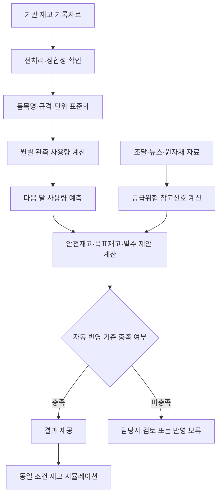

# 2026 사회보장 AI혁신 산학협력 프로젝트 최종 성과 보고서(2장 요약본 개정본)

## 1. 프로젝트 개요

- 과제명: 보건소 필수의료물품 적정재고 예측 모형
- 협업 부서: 한국사회보장정보원 보건의료정보부
- 참여대학·팀명: 동국대학교 Team_Lex
- 수행 목표: 보건기관의 입고·출고·재고 기록을 활용하여 다음 달 사용량과 필요한 재고량을 계산하고, 수급불안 상황에서 담당자가 확인할 근거를 제공함

## 2. 해결하고자 한 문제

보건기관은 PHIS로 재고를 관리하고 있으나 기관마다 물품명을 다르게 입력하여 같은 품목을 전국 단위로 비교하기 어려웠음. 또한 사용이 없는 달이 많고 일시적으로 사용량이 크게 증가하는 의료물품의 특성 때문에 단순 평균만으로 필요한 재고량을 정하기 어려웠음.

중동 지역 분쟁과 원자재 가격 변동은 폴리프로필렌(PP)을 사용하는 주사기 등의 생산과 공급에 영향을 줄 가능성이 있음. 다만 원자재 가격이 올랐다는 사실만으로 보건소의 사용량도 증가한다고 볼 수는 없음. 이에 본 과제는 다음 두 질문을 분리하여 검증하였음.

1. 다음 달 사용량을 기존의 단순 계산보다 정확하게 예측할 수 있는가?
2. 뉴스와 원자재 변화가 사용량이 아니라 공급지연 가능성을 설명하는 참고신호로 활용될 수 있는가?

## 3. 사용자료와 분석 절차

재고 기록자료는 2018~2019년과 2024~2025년을 합하여 일별 22,372,538행이었음. 약성분 자료, 조달청 계약상 납품기간, 원자재 시세, 관세청 수출입, 뉴스와 식약처 공급중단 자료를 함께 검토하였음.

전처리와 정합성 확인 과정에서는 음수 출고를 반품·취소·정정 내역으로 분리하고, 거래가 기록되지 않은 날을 사용량 0으로 복원하였음. 기관마다 다르게 작성된 품목명은 문자 표기, 규격과 단위를 정리하되 원래 품목명은 별도 보존하였음. 예를 들어 23G와 24G는 주사침 굵기가 다르므로 같은 품목으로 합치지 않았음.

요청량·충족량·미충족량 자료가 없어 재고 부족 때문에 실제로 사용하지 못한 수요는 복원하지 못했음. 따라서 본 보고서의 ‘수요’는 전산에서 확인된 양수 출고량, 즉 관측 사용량을 뜻함.

## 4. 주요 연구결과

### 가. 품목 표준화와 자료 품질

- 로컬 품목 기록 585,279행을 규격·단위를 포함한 표준품목 125,557종으로 정리함
- 과거 품목 중 같은 품목임을 확인할 수 있는 83.50%만 학습에 사용하고 나머지는 삭제하지 않고 별도 보존함
- 거래가 없는 날을 사용량 0으로 반영하자 일평균 사용량이 12.77개에서 1.95개로 조정됨. 이는 거래일만으로 평균을 내면 사용량이 약 6.5배 크게 계산될 수 있음을 보여 줌
- 과거자료를 현재자료와 엄격하게 연결한 결과 검증기간 WAPE가 39.223%에서 37.246%로 1.977%p 개선됨

### 나. 수요예측 결과

전체 실제 사용량을 기준으로 계산한 예측오차 비율인 WAPE가 가장 낮은 모형은 L1 모형이었음. 같은 2025년 8~12월 자료에서 최근 3개월 평균은 40.022%, L1은 35.714%였음.

다만 L1은 전체 사용량을 실제보다 9.617% 적게 예측하는 경향이 있었음. Tweedie 모형은 WAPE가 37.272%로 더 높았지만 과소예측은 1.971%로 작았음. 따라서 L1을 정확도 기준 대표모형으로 두고, L1과 Tweedie를 절반씩 결합한 안은 새로운 월 자료에서 확인할 대안으로 구분하였음.

중간 점검의 WAPE 37.184%·BIAS −3.467%는 당시 수요유형별 결합모형과 2025년 10~12월 평가조건에서 나온 값임. 최종 대표값 35.714%·−9.617%와는 평가기간·행수·모형설정이 달라 직접적인 전후 비교에 사용하지 않았음.

### 다. 재고 시뮬레이션 결과

예측모형 이외의 기간, 품목, 시작재고, 검토주기와 납품조건을 같게 두고 비교하였음. L1과 Tweedie를 절반씩 결합한 안은 L1 대비 발주량이 1.94% 늘어난 대신 미충족 수요가 2.52% 줄었음. 그러나 충족률 개선은 0.051%p로 작았음.

이 결과는 WAPE가 가장 낮은 모형이 항상 품절과 재고 측면에서도 가장 우수한 것은 아님을 보여 줌. 품절 1건의 손실비용과 재고 1개의 보유비용이 없어 어느 모형이 경제적으로 더 낫다고 확정하지 않았음.

### 라. 계약상 납품기간의 활용

기관자료에는 발주일과 실제 입고일이 모두 없어 품목별 실제 리드타임을 계산할 수 없었음. 이에 조달청 자료에서 계약서에 정한 납품기간을 비교 기준으로 사용하였음. 30일이 가장 흔했고 상위 구간에서는 60일과 94일이 확인되었음.

따라서 30일은 가장 흔한 계약기간을 반영한 기본 비교값이지 모든 품목의 실제 입고기간을 30일로 확정한 것이 아님. 종전 15일 대신 30일을 적용하면 계산상 목표재고가 약 30.4% 늘지만, 실제 품절이 그만큼 감소했다는 뜻도 아님. 실제 발주일·약속일·입고일을 확보하면 품목·기관·공급사별로 다시 계산해야 함.

24개월 조달자료는 수집 문서에 원자료 31,898건, 실행 코드에 유효 30,815건으로 기록되어 있음. 최종 제출 전 중복제거·필수값 확인·기간 필터에 따른 제외 건수를 대조하여 하나의 건수 흐름으로 제시해야 함.

### 마. 뉴스·원자재 분석 결과

초기에는 예측자료의 외부위험 15개 항목이 모두 0으로 저장되는 연결 결함이 있었음. 외부위험 점수파일을 다시 연결한 뒤 약 140만 건을 대상으로 재실험하였음.

뉴스와 원자재 정보를 사용량 예측에 직접 넣었을 때 전체 WAPE 개선은 0.009~0.101%p에 그쳤고, 원자재 위험과 다음 달 주사기 사용량의 상관계수도 0.012로 0에 가까웠음. 따라서 ‘원자재 가격 상승이 보건소의 주사기 사용량을 증가시킨다’는 설명은 채택하지 않았음.

대신 품목 분류정보를 이용하여 PP 재질 근거가 확인된 일회용 주사기만 원자재 자료와 연결하였음. 이를 통해 원자재 변화가 사용량이 아니라 제조·조달단계의 공급지연 가능성에 영향을 준다는 시나리오를 시험함. 평균 계약상 납품기간을 30.00일에서 34.19일로 조정했을 때 안전재고는 16.75% 증가하였음. 이는 실제 인과효과나 즉시 발주 지시가 아니라 필요한 추가재고 범위를 확인하는 시험 계산임.

## 5. 서비스 구현 결과와 범위

AI 저장소에는 전처리, 품목 표준화, 사용량 예측, 공급위험 계산, 재고정책 계산, 품질검사, 결과파일 생성과 조회용 API가 구현되어 있음. 백엔드에는 로그인·권한, 파일 접수, 데이터베이스와 REST·GraphQL API가 있으며, 프론트엔드에는 Next.js 기반 업무화면이 있음.

다만 수요예측, 공급위험, 재배치 제안과 외부지표 관련 일부 화면은 시범 또는 목업 자료를 사용함. 새 월 자료 업로드부터 AI 재실행, 데이터베이스 저장과 화면 갱신까지 완전히 자동으로 연결되는지도 추가 확인이 필요함. 따라서 화면이 있다는 사실과 실제 자료로 전 과정이 동작한다는 사실을 구분하여 보고함.

## 6. 연구의 한계와 후속 과제

1. 같은 형식의 신규 월 자료에서 모형 설정을 바꾸지 않고 독립 평가해야 함
2. 발주일·약속일·실제 입고일을 확보하여 계약상 납품기간 대신 실제 리드타임을 계산해야 함
3. 품절 요청량·충족량·미충족량을 확보하여 관측 사용량과 실제 필요량을 구분해야 함
4. 단가·보유비·폐기비·부족비를 확보하여 품절 감소와 재고 증가를 경제적 가치로 비교해야 함
5. 24개월 조달자료의 원자료 건수와 유효 건수 차이를 실행 명세로 정리해야 함
6. 시범·목업 화면과 실제 자료 기능을 구분하고 월별 자료부터 화면까지의 연결시험을 수행해야 함

## 7. 종합 결론

본 과제는 서로 다르게 입력된 대규모 재고 기록을 같은 품목 기준으로 정리하고, 단순 평균보다 낮은 예측오차를 보이는 모형과 재현 가능한 재고 계산 절차를 마련하였음. 또한 원자재 정보가 보건소 사용량을 직접 설명하지는 못했지만, 재질이 확인된 주사기의 공급지연 가능성을 검토하는 참고신호로 활용할 수 있음을 시험하였음.

연구결과는 현장 적용 가능성을 확인한 시범 수준임. 실제 발주에 사용하려면 최신 월 자료, 실제 주문·입고 기록, 비용자료와 서비스 전체 연결시험이 필요함. 따라서 최종 성과는 ‘자동발주 운영 완료’가 아니라 **품목 표준화, 수요예측, 재고정책과 공급위험을 하나의 검증 가능한 절차로 연결하고 그 한계와 다음 검증조건을 제시한 것**으로 정리함.
